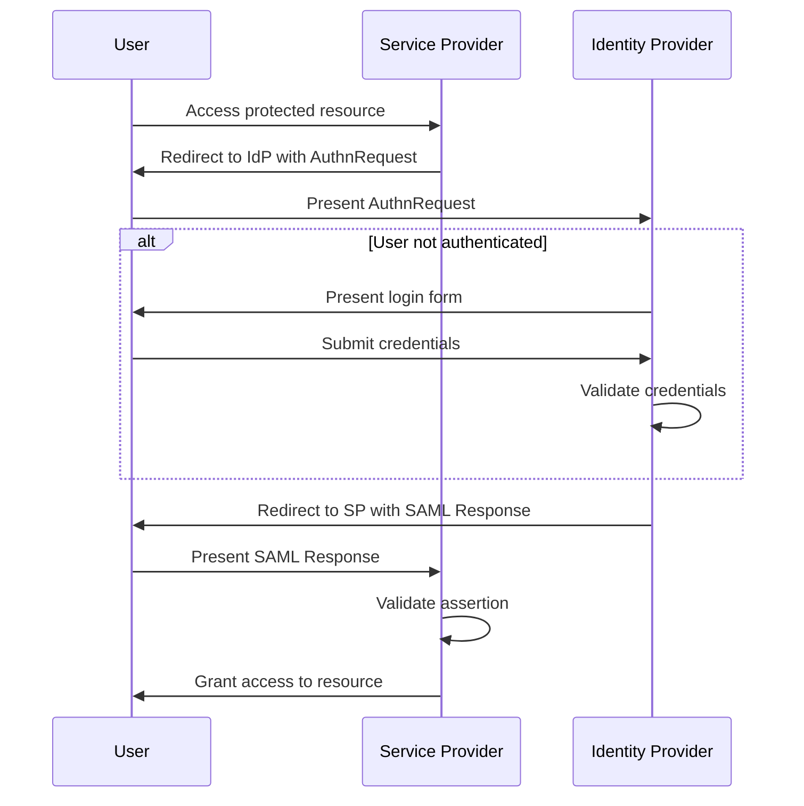
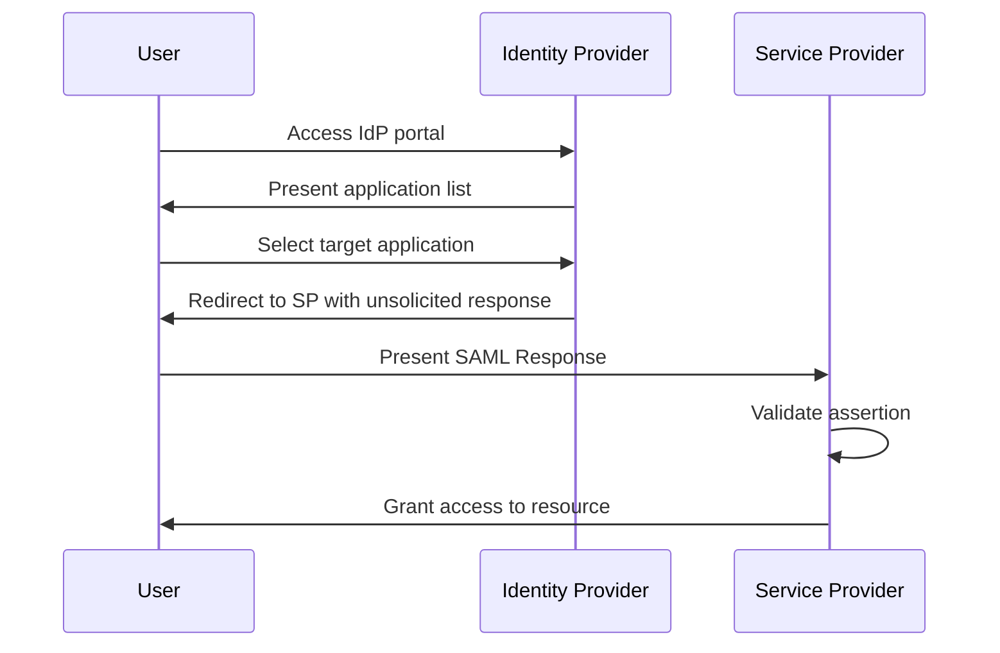
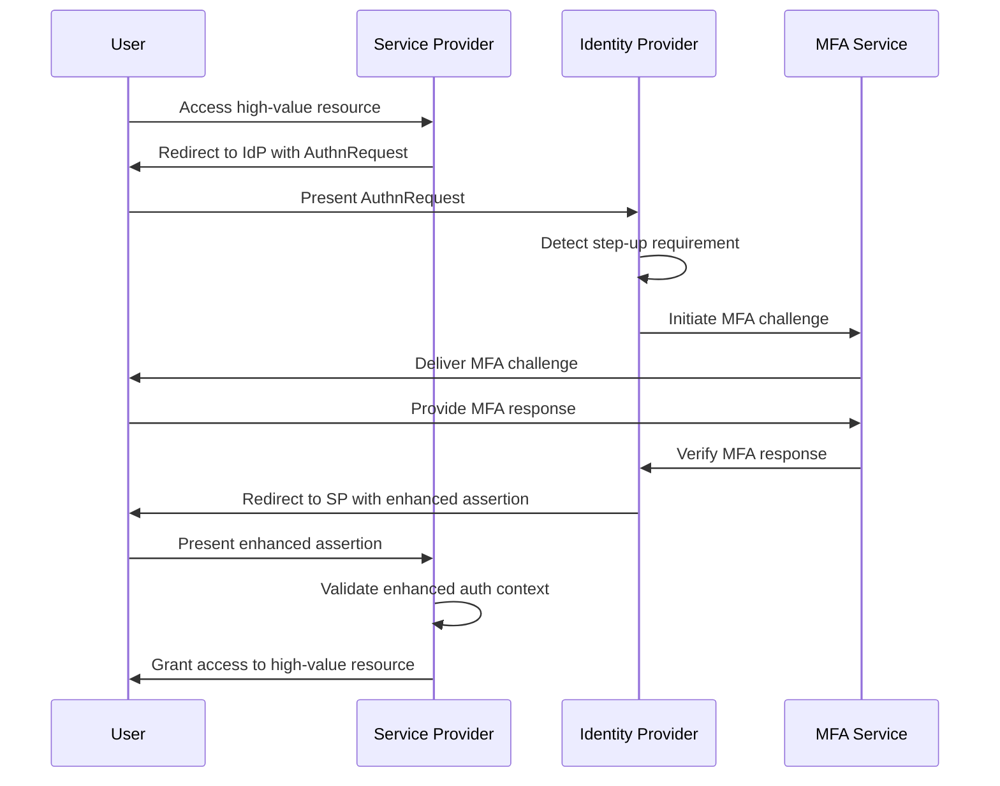
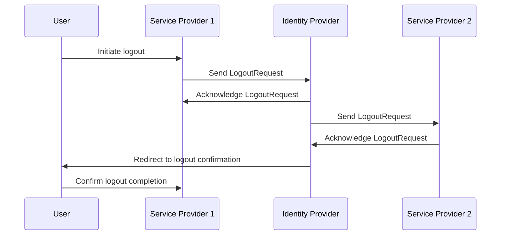

# Authentication Flows - Comprehensive Technical Guide

## Overview

Authentication flows define the sequence of interactions between users, Service Providers (SPs), and Identity Providers (IdPs) during Single Sign-On (SSO) processes. This comprehensive guide explores various SSO flows, implementation patterns, security considerations, and real-world scenarios.

## Core Authentication Flow Patterns

### Web Browser SSO Profile

#### SP-Initiated Flow (Most Common)

**Flow Sequence**:


**Detailed Implementation**:

```python
class SPInitiatedFlow:
    def __init__(self, sp_handler, session_manager):
        self.sp_handler = sp_handler
        self.session_manager = session_manager
    
    def handle_resource_request(self, request):
        """Handle initial resource request from user"""
        
        # Check for existing session
        session = self.session_manager.get_session(request)
        if session and session.is_valid():
            return self.grant_access(session)
        
        # No valid session - initiate SSO
        return self.initiate_sso(request)
    
    def initiate_sso(self, request):
        """Initiate SP-initiated SSO"""
        
        # Create AuthnRequest
        authn_request = self.create_authn_request(request)
        
        # Store request state
        request_state = {
            'request_id': authn_request.id,
            'relay_state': self.generate_relay_state(request),
            'created_at': datetime.utcnow(),
            'request_url': request.url
        }
        self.session_manager.store_request_state(authn_request.id, request_state)
        
        # Create redirect to IdP
        redirect_url = self.create_idp_redirect_url(authn_request)
        
        return RedirectResponse(redirect_url)
    
    def process_saml_response(self, saml_response, relay_state):
        """Process SAML response from IdP"""
        
        # Validate response
        validation_result = self.sp_handler.validate_saml_response(saml_response)
        if not validation_result.is_valid:
            raise AuthenticationError(f"Response validation failed: {validation_result.errors}")
        
        # Extract assertion
        assertion = validation_result.assertion
        
        # Retrieve original request state
        request_state = self.session_manager.get_request_state(assertion.in_response_to)
        if not request_state:
            raise AuthenticationError("Unknown request ID")
        
        # Create user session
        user_session = self.create_user_session(assertion, request_state)
        
        # Clean up request state
        self.session_manager.remove_request_state(assertion.in_response_to)
        
        return AuthenticationResult(
            success=True,
            user_session=user_session,
            redirect_url=request_state.get('request_url')
        )
```

#### IDP-Initiated Flow

**Flow Sequence**:


**Implementation Details**:

```python
class IdpInitiatedFlow:
    def __init__(self, sp_handler, trust_manager):
        self.sp_handler = sp_handler
        self.trust_manager = trust_manager
    
    def handle_unsolicited_response(self, saml_response, target_sp=None):
        """Handle unsolicited SAML response from IdP"""
        
        # Validate that we accept unsolicited responses
        if not self.trust_manager.accepts_unsolicited_responses():
            raise SecurityError("Unsolicited responses not allowed")
        
        # Validate response
        validation_result = self.sp_handler.validate_saml_response(saml_response)
        if not validation_result.is_valid:
            raise AuthenticationError(f"Response validation failed: {validation_result.errors}")
        
        # Extract assertion
        assertion = validation_result.assertion
        
        # Verify target SP matches our entity ID
        if target_sp and target_sp != self.sp_handler.entity_id:
            raise SecurityError("Target SP mismatch")
        
        # Create user session
        user_session = self.create_user_session(assertion)
        
        return AuthenticationResult(
            success=True,
            user_session=user_session,
            redirect_url=self.get_default_landing_page()
        )
```

### Enhanced Client or Proxy (ECP) Profile

**Use Cases**:
- Non-browser clients (mobile apps, desktop applications)
- SOAP-based web services
- Automated systems

**Flow Implementation**:

```python
class ECPFlow:
    def __init__(self, sp_handler, soap_client):
        self.sp_handler = sp_handler
        self.soap_client = soap_client
    
    def authenticate_client(self, client_request, credentials):
        """Authenticate non-browser client using ECP profile"""
        
        # Create ECP-specific AuthnRequest
        ecp_request = self.create_ecp_authn_request(client_request)
        
        # Send SOAP request to IdP
        soap_response = self.soap_client.send_request(ecp_request, credentials)
        
        # Extract SAML assertion from SOAP response
        assertion = self.extract_assertion_from_soap(soap_response)
        
        # Validate assertion
        validation_result = self.sp_handler.validate_assertion(assertion)
        if not validation_result.is_valid:
            raise AuthenticationError(f"Assertion validation failed: {validation_result.errors}")
        
        # Create client session
        client_session = self.create_client_session(assertion)
        
        return AuthenticationResult(
            success=True,
            user_session=client_session,
            access_token=client_session.access_token
        )
```

## Advanced Flow Patterns

### Multi-Factor Authentication (MFA) Integration

#### Step-Up Authentication Flow

**Flow Sequence**:


**Implementation**:

```python
class StepUpAuthenticationFlow:
    def __init__(self, sp_handler, mfa_service):
        self.sp_handler = sp_handler
        self.mfa_service = mfa_service
    
    def handle_step_up_request(self, request, required_auth_level):
        """Handle request requiring step-up authentication"""
        
        # Check existing session
        session = self.session_manager.get_session(request)
        
        if session and session.auth_level >= required_auth_level:
            # Session already meets requirements
            return self.grant_access(session)
        
        # Session needs step-up
        return self.initiate_step_up(request, session, required_auth_level)
    
    def initiate_step_up(self, request, existing_session, required_auth_level):
        """Initiate step-up authentication"""
        
        # Create AuthnRequest with requested auth context
        authn_request = self.create_step_up_authn_request(
            request, 
            required_auth_level
        )
        
        # Store step-up context
        step_up_context = {
            'original_session_id': existing_session.id if existing_session else None,
            'required_auth_level': required_auth_level,
            'request_url': request.url
        }
        self.session_manager.store_step_up_context(authn_request.id, step_up_context)
        
        # Redirect to IdP
        redirect_url = self.create_idp_redirect_url(authn_request)
        
        return RedirectResponse(redirect_url)
    
    def process_step_up_response(self, saml_response):
        """Process step-up authentication response"""
        
        # Validate response
        validation_result = self.sp_handler.validate_saml_response(saml_response)
        if not validation_result.is_valid:
            raise AuthenticationError(f"Step-up response validation failed")
        
        # Extract assertion
        assertion = validation_result.assertion
        
        # Verify enhanced auth context
        if not self.verify_enhanced_auth_context(assertion):
            raise AuthenticationError("Insufficient authentication level")
        
        # Retrieve step-up context
        step_up_context = self.session_manager.get_step_up_context(assertion.in_response_to)
        
        # Update or create session
        if step_up_context['original_session_id']:
            # Upgrade existing session
            user_session = self.upgrade_session(
                step_up_context['original_session_id'],
                assertion
            )
        else:
            # Create new session
            user_session = self.create_user_session(assertion)
        
        return AuthenticationResult(
            success=True,
            user_session=user_session,
            redirect_url=step_up_context.get('request_url')
        )
```

### Just-in-Time (JIT) Provisioning Flow

**Use Cases**:
- User creation on first login
- Dynamic attribute synchronization
- Role assignment based on IdP attributes

**Implementation**:

```python
class JITProvisioningFlow:
    def __init__(self, user_provisioning_service, attribute_mapper):
        self.user_provisioning_service = user_provisioning_service
        self.attribute_mapper = attribute_mapper
    
    def provision_user_from_assertion(self, assertion):
        """Provision user based on SAML assertion"""
        
        # Extract user identifier
        user_identifier = self.extract_user_identifier(assertion)
        
        # Check if user exists
        existing_user = self.user_provisioning_service.get_user(user_identifier)
        
        if existing_user:
            # Update existing user
            updated_user = self.update_user_attributes(existing_user, assertion)
            return updated_user
        else:
            # Create new user
            user_attributes = self.attribute_mapper.map_attributes(assertion)
            new_user = self.user_provisioning_service.create_user(
                user_identifier, 
                user_attributes
            )
            return new_user
    
    def extract_user_identifier(self, assertion):
        """Extract unique user identifier from assertion"""
        
        # Prefer NameID
        if assertion.subject and assertion.subject.name_id:
            return assertion.subject.name_id.value
        
        # Fall back to email attribute
        email_attr = self.find_attribute(assertion, 'email')
        if email_attr:
            return email_attr
        
        # Fall back to username attribute
        username_attr = self.find_attribute(assertion, 'username')
        if username_attr:
            return username_attr
        
        raise ProvisioningError("Unable to extract user identifier from assertion")
    
    def update_user_attributes(self, user, assertion):
        """Update user attributes from assertion"""
        
        current_attributes = user.attributes
        new_attributes = self.attribute_mapper.map_attributes(assertion)
        
        # Merge attributes (new values override existing)
        merged_attributes = {**current_attributes, **new_attributes}
        
        # Update user
        updated_user = self.user_provisioning_service.update_user(
            user.id, 
            merged_attributes
        )
        
        return updated_user
```

## Single Logout (SLO) Flows

### SP-Initiated Single Logout

**Flow Sequence**:


**Implementation**:

```python
class SingleLogoutFlow:
    def __init__(self, sp_handler, session_manager, logout_coordinator):
        self.sp_handler = sp_handler
        self.session_manager = session_manager
        self.logout_coordinator = logout_coordinator
    
    def initiate_logout(self, request):
        """Initiate single logout from SP"""
        
        # Get current session
        session = self.session_manager.get_session(request)
        if not session:
            return self.complete_logout_locally()
        
        # Create LogoutRequest
        logout_request = self.create_logout_request(session)
        
        # Store logout state
        logout_state = {
            'session_id': session.id,
            'user_id': session.user_id,
            'created_at': datetime.utcnow(),
            'participating_sps': session.active_sp_sessions
        }
        self.logout_coordinator.store_logout_state(logout_request.id, logout_state)
        
        # Send LogoutRequest to IdP
        redirect_url = self.create_logout_redirect_url(logout_request)
        
        return RedirectResponse(redirect_url)
    
    def process_logout_response(self, logout_response):
        """Process LogoutResponse from IdP"""
        
        # Validate response
        if not self.validate_logout_response(logout_response):
            raise LogoutError("Invalid logout response")
        
        # Retrieve logout state
        logout_state = self.logout_coordinator.get_logout_state(logout_response.in_response_to)
        
        # Complete local logout
        self.complete_local_logout(logout_state)
        
        # Clean up logout state
        self.logout_coordinator.remove_logout_state(logout_response.in_response_to)
        
        return LogoutResult(success=True)
    
    def handle_logout_request(self, logout_request):
        """Handle LogoutRequest from IdP"""
        
        # Validate request
        if not self.validate_logout_request(logout_request):
            raise LogoutError("Invalid logout request")
        
        # Extract session information
        session_identifier = self.extract_session_identifier(logout_request)
        
        # Terminate session
        self.terminate_session(session_identifier)
        
        # Send LogoutResponse
        logout_response = self.create_logout_response(logout_request)
        
        return logout_response
```

### Front-Channel vs Back-Channel Logout

#### Front-Channel Logout

**Implementation**:
```python
class FrontChannelLogout:
    def handle_front_channel_logout(self, request):
        """Handle front-channel logout via browser redirect"""
        
        # Extract SAMLRequest parameter
        saml_request = request.args.get('SAMLRequest')
        if not saml_request:
            raise LogoutError("Missing SAMLRequest parameter")
        
        # Decode and parse LogoutRequest
        logout_request = self.decode_logout_request(saml_request)
        
        # Terminate session
        self.terminate_session_by_name_id(logout_request.name_id)
        
        # Redirect to logout completion
        return RedirectResponse(self.get_logout_completion_url())
```

#### Back-Channel Logout

**Implementation**:
```python
class BackChannelLogout:
    def handle_back_channel_logout(self, soap_request):
        """Handle back-channel logout via SOAP"""
        
        # Extract LogoutRequest from SOAP
        logout_request = self.extract_logout_request_from_soap(soap_request)
        
        # Validate request
        if not self.validate_soap_logout_request(logout_request):
            raise LogoutError("Invalid SOAP logout request")
        
        # Terminate session
        session_terminated = self.terminate_session_by_session_index(
            logout_request.session_index
        )
        
        # Create SOAP response
        soap_response = self.create_soap_logout_response(session_terminated)
        
        return soap_response
```

## Error Handling and Recovery Flows

### Comprehensive Error Handling

```python
class ErrorHandlingFlow:
    def __init__(self, error_mapper, recovery_service):
        self.error_mapper = error_mapper
        self.recovery_service = recovery_service
    
    def handle_authentication_error(self, error, context):
        """Handle authentication errors gracefully"""
        
        # Map technical error to user-friendly message
        user_message = self.error_mapper.map_error(error, context)
        
        # Determine recovery action
        recovery_action = self.determine_recovery_action(error, context)
        
        # Log error for monitoring
        self.log_authentication_error(error, context)
        
        return ErrorResponse(
            user_message=user_message,
            recovery_action=recovery_action,
            technical_details=self.get_technical_details(error)
        )
    
    def determine_recovery_action(self, error, context):
        """Determine appropriate recovery action"""
        
        if isinstance(error, SignatureValidationError):
            return RecoveryAction.RETRY_WITH_FRESH_METADATA
        
        elif isinstance(error, TimestampValidationError):
            return RecoveryAction.CHECK_SYSTEM_TIME
        
        elif isinstance(error, AssertionExpiredError):
            return RecoveryAction.REAUTHENTICATE
        
        elif isinstance(error, IdpUnavailableError):
            return RecoveryAction.FALLBACK_TO_LOCAL_AUTH
        
        else:
            return RecoveryAction.CONTACT_SUPPORT
    
    def handle_idp_unavailability(self, original_request):
        """Handle IdP unavailability"""
        
        # Check if fallback authentication is enabled
        if self.recovery_service.fallback_enabled():
            return self.initiate_fallback_authentication(original_request)
        
        # Show maintenance page
        return self.show_maintenance_page(original_request)
```

### Graceful Degradation

```python
class GracefulDegradationFlow:
    def __init__(self, primary_auth, fallback_auth, health_checker):
        self.primary_auth = primary_auth
        self.fallback_auth = fallback_auth
        self.health_checker = health_checker
    
    def authenticate_with_fallback(self, request):
        """Authenticate with fallback if primary fails"""
        
        # Check primary authentication health
        if self.health_checker.is_primary_healthy():
            try:
                return self.primary_auth.authenticate(request)
            except AuthenticationError as e:
                logger.warning(f"Primary authentication failed: {e}")
        
        # Fall back to secondary authentication
        logger.info("Falling back to secondary authentication")
        return self.fallback_auth.authenticate(request)
```

## Performance-Optimized Flows

### Cached Authentication Flow

```python
class CachedAuthenticationFlow:
    def __init__(self, auth_service, cache_manager):
        self.auth_service = auth_service
        self.cache_manager = cache_manager
    
    def authenticate_with_cache(self, assertion):
        """Authenticate using cached validation results"""
        
        cache_key = self.generate_cache_key(assertion)
        
        # Check cache first
        cached_result = self.cache_manager.get(cache_key)
        if cached_result:
            logger.debug("Using cached authentication result")
            return cached_result
        
        # Perform full validation
        validation_result = self.auth_service.validate_assertion(assertion)
        
        # Cache result
        if validation_result.is_valid:
            self.cache_manager.set(
                cache_key, 
                validation_result, 
                ttl=300  # 5 minutes
            )
        
        return validation_result
```

### Parallel Session Validation

```python
import asyncio

class ParallelValidationFlow:
    async def validate_assertion_parallel(self, assertion):
        """Validate assertion using parallel checks"""
        
        # Define validation tasks
        validation_tasks = [
            self.validate_signature(assertion),
            self.validate_timestamps(assertion),
            self.validate_conditions(assertion),
            self.validate_audience(assertion),
            self.check_replay_attack(assertion)
        ]
        
        # Execute validations in parallel
        results = await asyncio.gather(*validation_tasks, return_exceptions=True)
        
        # Combine results
        errors = []
        for result in results:
            if isinstance(result, Exception):
                errors.append(str(result))
            elif not result.is_valid:
                errors.extend(result.errors)
        
        return ValidationResult(
            is_valid=len(errors) == 0,
            errors=errors,
            assertion=assertion
        )
```

## Security-Specific Flows

### Replay Attack Prevention

```python
class ReplayAttackPrevention:
    def __init__(self, used_assertion_tracker, time_window=300):
        self.used_assertion_tracker = used_assertion_tracker
        self.time_window = time_window  # 5 minutes
    
    def check_for_replay_attack(self, assertion):
        """Check if assertion has been replayed"""
        
        assertion_id = assertion.id
        
        # Check if we've seen this assertion ID
        if self.used_assertion_tracker.has_been_used(assertion_id):
            return ReplayCheckResult(
                is_replay=True,
                reason="Duplicate assertion ID"
            )
        
        # Check timestamp freshness
        issue_instant = assertion.issue_instant
        current_time = datetime.utcnow()
        
        time_difference = (current_time - issue_instant).total_seconds()
        
        if time_difference > self.time_window:
            return ReplayCheckResult(
                is_replay=True,
                reason=f"Assertion too old: {time_difference} seconds"
            )
        
        # Mark assertion as used
        self.used_assertion_tracker.mark_as_used(assertion_id)
        
        return ReplayCheckResult(is_replay=False)
```

### Man-in-the-Middle Protection

```python
class MITMProtectionFlow:
    def __init__(self, certificate_pinner, message_validator):
        self.certificate_pinner = certificate_pinner
        self.message_validator = message_validator
    
    def validate_message_integrity(self, message, expected_recipient):
        """Validate message integrity and prevent MITM attacks"""
        
        # Verify certificate pinning
        if not self.certificate_pinner.verify_certificate(message.certificate):
            raise SecurityError("Certificate pinning violation")
        
        # Verify message signature
        if not self.message_validator.verify_signature(message):
            raise SecurityError("Message signature invalid")
        
        # Verify destination
        if message.destination != expected_recipient:
            raise SecurityError("Message destination mismatch")
        
        # Verify timestamps
        if not self.validate_message_timestamps(message):
            raise SecurityError("Message timestamps invalid")
        
        return True
```

## Testing and Validation Flows

### Comprehensive Flow Testing

```python
class FlowTestHarness:
    def __init__(self, test_scenarios, assertion_generator):
        self.test_scenarios = test_scenarios
        self.assertion_generator = assertion_generator
    
    def test_authentication_flow(self, flow_name, test_parameters):
        """Test specific authentication flow"""
        
        test_results = []
        
        for scenario in self.test_scenarios[flow_name]:
            # Generate test assertion
            test_assertion = self.assertion_generator.generate_assertion(
                scenario.attributes
            )
            
            # Execute flow
            try:
                result = self.execute_flow(flow_name, test_assertion, test_parameters)
                test_results.append(FlowTestResult(
                    scenario=scenario.name,
                    success=True,
                    result=result
                ))
            except Exception as e:
                test_results.append(FlowTestResult(
                    scenario=scenario.name,
                    success=False,
                    error=str(e)
                ))
        
        return FlowTestReport(
            flow_name=flow_name,
            results=test_results,
            success_rate=self.calculate_success_rate(test_results)
        )
```

## Conclusion

Authentication flows are the backbone of SSO implementations, defining how users interact with Service Providers and Identity Providers. This comprehensive guide has covered the essential flow patterns, implementation details, and security considerations for building robust SSO systems.

Key success factors include:
- Proper implementation of standard flows (SP-initiated, IDP-initiated, ECP)
- Support for advanced scenarios (MFA, step-up authentication, JIT provisioning)
- Comprehensive logout handling with SLO support
- Robust error handling and graceful degradation
- Performance optimization through caching and parallel processing
- Strong security measures against replay and MITM attacks

By understanding and implementing these flow patterns correctly, organizations can build SSO solutions that provide secure, seamless authentication experiences while maintaining high standards of security and reliability.