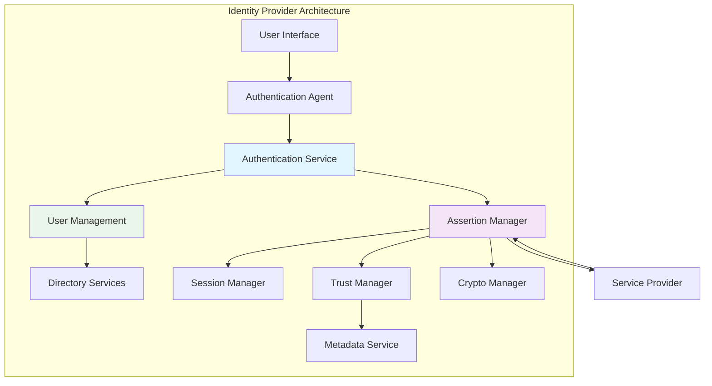

# Identity Provider (IDP) - Comprehensive Technical Guide

## Overview

An Identity Provider (IdP) is a critical component in Single Sign-On (SSO) architectures that authenticates users and issues security assertions to Service Providers. This comprehensive guide explores IdP architecture, implementation patterns, security considerations, and operational best practices.

## IdP Architecture Deep Dive

### Core Components Architecture



### Authentication Service Layer

#### Multi-Factor Authentication Integration

```python
class AuthenticationService:
    def __init__(self, user_store, mfa_providers, session_manager):
        self.user_store = user_store
        self.mfa_providers = mfa_providers
        self.session_manager = session_manager
    
    def authenticate_user(self, username, password, context=None):
        # Primary authentication
        user = self.user_store.authenticate(username, password)
        if not user:
            raise AuthenticationError("Invalid credentials")
        
        # Risk assessment
        risk_level = self.assess_risk(user, context)
        
        # MFA requirement based on risk
        if risk_level > self.mfa_threshold:
            mfa_result = self.perform_mfa_authentication(user, context)
            if not mfa_result:
                raise AuthenticationError("MFA verification failed")
        
        # Create authentication session
        auth_session = self.session_manager.create_auth_session(user)
        
        return auth_session
    
    def assess_risk(self, user, context):
        risk_score = 0
        
        # Geographic risk
        if context.get('ip_country') != user.home_country:
            risk_score += 20
        
        # Device risk
        if not self.is_trusted_device(user, context.get('device_fingerprint')):
            risk_score += 15
        
        # Time risk
        if self.is_unusual_login_time(user, context.get('login_time')):
            risk_score += 10
        
        return risk_score
```

## Detailed IdP Implementation

### User Management System

#### Directory Integration Patterns

**Active Directory Integration**:
```python
import ldap3
from ldap3 import Server, Connection, ALL

class ActiveDirectoryIntegration:
    def __init__(self, server_url, domain, service_account, service_password):
        self.server = Server(server_url, get_info=ALL)
        self.domain = domain
        self.service_account = service_account
        self.service_password = service_password
    
    def authenticate_user(self, username, password):
        user_dn = f"CN={username},OU=Users,DC={self.domain},DC=com"
        
        try:
            # Bind as service account to search
            conn = Connection(self.server, 
                            user=f"{self.service_account}@{self.domain}.com",
                            password=self.service_password,
                            auto_bind=True)
            
            # Search for user
            conn.search(user_dn, '(objectClass=user)', attributes=['*'])
            
            if conn.entries:
                # Attempt to bind as user
                user_conn = Connection(self.server, user=user_dn, password=password)
                if user_conn.bind():
                    return self.extract_user_info(conn.entries[0])
        
        except ldap3.core.exceptions.LDAPException as e:
            logger.error(f"LDAP authentication failed: {e}")
        
        return None
    
    def extract_user_info(self, ldap_entry):
        return {
            'username': ldap_entry.sAMAccountName.value,
            'email': ldap_entry.mail.value,
            'display_name': ldap_entry.displayName.value,
            'groups': [group.split(',')[0].split('=')[1] 
                      for group in ldap_entry.memberOf.value]
        }
```

**LDAP Integration**:
```python
class LDAPUserStore:
    def __init__(self, ldap_config):
        self.ldap_config = ldap_config
        self.connection_pool = self.create_connection_pool()
    
    def get_user_attributes(self, username, attributes=None):
        conn = self.connection_pool.get_connection()
        
        try:
            search_filter = f"(uid={username})"
            conn.search(
                self.ldap_config['base_dn'],
                search_filter,
                attributes=attributes or ['*']
            )
            
            if conn.entries:
                return self.normalize_ldap_entry(conn.entries[0])
        
        finally:
            self.connection_pool.release_connection(conn)
        
        return None
```

### Assertion Generation Service

#### Comprehensive Assertion Builder

```python
from datetime import datetime, timedelta
import uuid

class AssertionBuilder:
    def __init__(self, idp_config, crypto_service):
        self.idp_config = idp_config
        self.crypto_service = crypto_service
    
    def create_authentication_assertion(self, user, auth_session, sp_entity_id):
        assertion_id = f"_{uuid.uuid4()}"
        issue_instant = datetime.utcnow()
        
        # Build assertion structure
        assertion = {
            'id': assertion_id,
            'issue_instant': issue_instant.isoformat() + 'Z',
            'issuer': self.idp_config['entity_id'],
            'subject': self.build_subject(user, sp_entity_id),
            'conditions': self.build_conditions(sp_entity_id),
            'authn_statement': self.build_authn_statement(auth_session),
            'attribute_statement': self.build_attribute_statement(user)
        }
        
        # Sign assertion
        signed_assertion = self.crypto_service.sign_assertion(assertion)
        
        return signed_assertion
    
    def build_subject(self, user, sp_entity_id):
        name_id_format = self.determine_name_id_format(user, sp_entity_id)
        
        return {
            'name_id': {
                'format': name_id_format,
                'value': self.format_name_id(user, name_id_format)
            },
            'subject_confirmation': {
                'method': 'urn:oasis:names:tc:SAML:2.0:cm:bearer',
                'data': {
                    'not_on_or_after': (datetime.utcnow() + timedelta(minutes=5)).isoformat() + 'Z',
                    'recipient': self.get_sp_acs_url(sp_entity_id),
                    'in_response_to': auth_session.request_id
                }
            }
        }
    
    def build_conditions(self, sp_entity_id):
        not_before = datetime.utcnow() - timedelta(minutes=2)
        not_on_or_after = datetime.utcnow() + timedelta(minutes=5)
        
        return {
            'not_before': not_before.isoformat() + 'Z',
            'not_on_or_after': not_on_or_after.isoformat() + 'Z',
            'audience_restriction': {
                'audience': sp_entity_id
            }
        }
```

## IdP Metadata Management

### Dynamic Metadata Service

```python
class IdpMetadataService:
    def __init__(self, idp_config, certificate_manager):
        self.idp_config = idp_config
        self.certificate_manager = certificate_manager
    
    def generate_metadata(self):
        metadata = {
            'entity_id': self.idp_config['entity_id'],
            'valid_until': (datetime.utcnow() + timedelta(days=365)).isoformat() + 'Z',
            'organization': self.idp_config.get('organization', {}),
            'contact_persons': self.idp_config.get('contact_persons', []),
            'idp_sso_descriptor': self.build_idp_sso_descriptor()
        }
        
        return self.serialize_metadata(metadata)
    
    def build_idp_sso_descriptor(self):
        return {
            'want_authn_requests_signed': True,
            'protocol_support_enumeration': 'urn:oasis:names:tc:SAML:2.0:protocol',
            'key_descriptors': self.build_key_descriptors(),
            'single_sign_on_services': self.build_sso_services(),
            'single_logout_services': self.build_slo_services(),
            'name_id_formats': self.build_name_id_formats(),
            'attribute_profiles': self.build_attribute_profiles(),
            'attributes': self.build_attributes()
        }
    
    def build_key_descriptors(self):
        certificates = self.certificate_manager.get_signing_certificates()
        
        key_descriptors = []
        for cert in certificates:
            key_descriptors.append({
                'use': 'signing',
                'key_info': {
                    'x509_data': {
                        'x509_certificate': cert.public_bytes()
                    }
                }
            })
        
        return key_descriptors
    
    def build_sso_services(self):
        return [
            {
                'binding': 'urn:oasis:names:tc:SAML:2.0:bindings:HTTP-Redirect',
                'location': f"{self.idp_config['base_url']}/sso/redirect"
            },
            {
                'binding': 'urn:oasis:names:tc:SAML:2.0:bindings:HTTP-POST',
                'location': f"{self.idp_config['base_url']}/sso/post"
            }
        ]
```

## Trust Management System

### Service Provider Registration

```python
class TrustManager:
    def __init__(self, metadata_repository, certificate_validator):
        self.metadata_repository = metadata_repository
        self.certificate_validator = certificate_validator
    
    def register_sp(self, sp_metadata_url, configuration=None):
        # Fetch and validate SP metadata
        sp_metadata = self.fetch_sp_metadata(sp_metadata_url)
        
        if not self.validate_sp_metadata(sp_metadata):
            raise TrustError("Invalid SP metadata")
        
        # Extract and validate certificates
        sp_certificates = self.extract_certificates(sp_metadata)
        for cert in sp_certificates:
            if not self.certificate_validator.validate_certificate(cert):
                raise TrustError(f"Invalid certificate: {cert.subject}")
        
        # Store SP configuration
        sp_config = {
            'entity_id': sp_metadata['entity_id'],
            'acs_urls': self.extract_acs_urls(sp_metadata),
            'certificates': sp_certificates,
            'metadata_url': sp_metadata_url,
            'attributes_required': configuration.get('attributes_required', []),
            'name_id_format': configuration.get('name_id_format'),
            'created_at': datetime.utcnow(),
            'updated_at': datetime.utcnow()
        }
        
        self.metadata_repository.store_sp_config(sp_config)
        
        return sp_config
    
    def validate_authn_request(self, authn_request, sp_entity_id):
        sp_config = self.metadata_repository.get_sp_config(sp_entity_id)
        
        if not sp_config:
            raise TrustError(f"Unknown SP: {sp_entity_id}")
        
        # Validate request signature
        if not self.validate_request_signature(authn_request, sp_config):
            raise SecurityError("Invalid request signature")
        
        # Validate destination
        if authn_request.destination != self.idp_config['sso_url']:
            raise SecurityError("Invalid destination")
        
        # Validate timestamps
        if not self.validate_request_timestamps(authn_request):
            raise SecurityError("Request timestamps invalid")
        
        return True
```

## Session Management

### Distributed Session Storage

```python
import redis
import json
from datetime import datetime, timedelta

class DistributedSessionManager:
    def __init__(self, redis_config, session_ttl=3600):
        self.redis_pool = redis.ConnectionPool(**redis_config)
        self.session_ttl = session_ttl
    
    def create_session(self, user_id, auth_context):
        session_id = f"sess_{uuid.uuid4()}"
        
        session_data = {
            'user_id': user_id,
            'created_at': datetime.utcnow().isoformat(),
            'last_accessed': datetime.utcnow().isoformat(),
            'auth_context': auth_context,
            'active_sp_sessions': {},
            'attributes': {}
        }
        
        redis_client = redis.Redis(connection_pool=self.redis_pool)
        redis_client.setex(
            f"session:{session_id}",
            self.session_ttl,
            json.dumps(session_data)
        )
        
        # Store user->session mapping
        redis_client.sadd(f"user_sessions:{user_id}", session_id)
        
        return session_id
    
    def get_session(self, session_id):
        redis_client = redis.Redis(connection_pool=self.redis_pool)
        
        session_data = redis_client.get(f"session:{session_id}")
        if session_data:
            # Update last accessed time
            session_dict = json.loads(session_data)
            session_dict['last_accessed'] = datetime.utcnow().isoformat()
            redis_client.setex(
                f"session:{session_id}",
                self.session_ttl,
                json.dumps(session_dict)
            )
            
            return session_dict
        
        return None
    
    def add_sp_session(self, session_id, sp_entity_id, sp_session_id):
        redis_client = redis.Redis(connection_pool=self.redis_pool)
        
        session_data = self.get_session(session_id)
        if session_data:
            session_data['active_sp_sessions'][sp_entity_id] = sp_session_id
            redis_client.setex(
                f"session:{session_id}",
                self.session_ttl,
                json.dumps(session_data)
            )
```

## Advanced Authentication Features

### Risk-Based Authentication

```python
class RiskEngine:
    def __init__(self, rules_engine, threat_intelligence):
        self.rules_engine = rules_engine
        self.threat_intelligence = threat_intelligence
    
    def evaluate_authentication_risk(self, auth_request, user_context):
        risk_score = 0
        risk_factors = []
        
        # Geographic analysis
        geo_risk = self.analyze_geographic_risk(auth_request.ip_address, user_context)
        risk_score += geo_risk.score
        risk_factors.extend(geo_risk.factors)
        
        # Behavioral analysis
        behavior_risk = self.analyze_behavioral_risk(user_context)
        risk_score += behavior_risk.score
        risk_factors.extend(behavior_risk.factors)
        
        # Device analysis
        device_risk = self.analyze_device_risk(auth_request.user_agent, auth_request.device_fingerprint)
        risk_score += device_risk.score
        risk_factors.extend(device_risk.factors)
        
        # Threat intelligence
        threat_risk = self.threat_intelligence.check_ip_reputation(auth_request.ip_address)
        risk_score += threat_risk.score
        risk_factors.extend(threat_risk.factors)
        
        return RiskAssessment(
            score=risk_score,
            factors=risk_factors,
            level=self.determine_risk_level(risk_score)
        )
    
    def determine_risk_level(self, score):
        if score >= 80:
            return 'HIGH'
        elif score >= 60:
            return 'MEDIUM'
        elif score >= 30:
            return 'LOW'
        else:
            return 'VERY_LOW'
```

### Adaptive Authentication

```python
class AdaptiveAuthentication:
    def __init__(self, risk_engine, mfa_providers):
        self.risk_engine = risk_engine
        self.mfa_providers = mfa_providers
    
    def determine_authentication_requirements(self, auth_request, user_context):
        risk_assessment = self.risk_engine.evaluate_authentication_risk(auth_request, user_context)
        
        requirements = {
            'primary_auth': True,
            'mfa_required': False,
            'mfa_methods': [],
            'step_up_auth': False,
            'additional_verification': False
        }
        
        if risk_assessment.level in ['MEDIUM', 'HIGH']:
            requirements['mfa_required'] = True
            
            if risk_assessment.level == 'HIGH':
                requirements['mfa_methods'] = ['push_notification', 'hardware_token']
                requirements['step_up_auth'] = True
            else:
                requirements['mfa_methods'] = ['sms', 'email']
        
        return requirements
```

## Security Implementation

### Cryptographic Services

```python
from cryptography.hazmat.primitives import hashes, serialization
from cryptography.hazmat.primitives.asymmetric import rsa, padding
from cryptography.x509 import load_pem_x509_certificate
import base64

class CryptographicService:
    def __init__(self, key_store, certificate_store):
        self.key_store = key_store
        self.certificate_store = certificate_store
    
    def sign_assertion(self, assertion_xml):
        private_key = self.key_store.get_signing_key()
        
        # Create XML signature
        signature = self.create_xml_signature(assertion_xml, private_key)
        
        # Insert signature into assertion
        signed_assertion = self.insert_signature(assertion_xml, signature)
        
        return signed_assertion
    
    def verify_request_signature(self, authn_request_xml, sp_certificate):
        # Extract signature from request
        signature = self.extract_signature(authn_request_xml)
        
        # Verify signature
        try:
            public_key = sp_certificate.public_key()
            public_key.verify(
                base64.b64decode(signature['value']),
                self.canonicalize_signed_info(signature['signed_info']),
                padding.PKCS1v15(),
                hashes.SHA256()
            )
            return True
        except Exception as e:
            logger.error(f"Signature verification failed: {e}")
            return False
    
    def encrypt_assertion(self, assertion_xml, sp_certificate):
        # Generate symmetric key
        symmetric_key = os.urandom(32)
        
        # Encrypt assertion with symmetric key
        iv = os.urandom(16)
        encrypted_data = self.aes_encrypt(assertion_xml, symmetric_key, iv)
        
        # Encrypt symmetric key with SP public key
        encrypted_key = sp_certificate.public_key().encrypt(
            symmetric_key,
            padding.OAEP(
                mgf=padding.MGF1(algorithm=hashes.SHA256()),
                algorithm=hashes.SHA256(),
                label=None
            )
        )
        
        return self.create_encrypted_assertion(encrypted_data, encrypted_key, iv)
```

## Monitoring and Analytics

### Comprehensive Logging

```python
import structlog
from datetime import datetime

class IdpAuditLogger:
    def __init__(self):
        self.logger = structlog.get_logger()
    
    def log_authentication_success(self, user_id, auth_context, risk_level):
        self.logger.info(
            "authentication_success",
            user_id=user_id,
            timestamp=datetime.utcnow().isoformat(),
            auth_method=auth_context.get('auth_method'),
            risk_level=risk_level,
            ip_address=auth_context.get('ip_address'),
            user_agent=auth_context.get('user_agent'),
            session_id=auth_context.get('session_id')
        )
    
    def log_authentication_failure(self, username, reason, auth_context):
        self.logger.warning(
            "authentication_failure",
            username=username,
            timestamp=datetime.utcnow().isoformat(),
            reason=reason,
            ip_address=auth_context.get('ip_address'),
            user_agent=auth_context.get('user_agent')
        )
    
    def log_assertion_issued(self, user_id, sp_entity_id, assertion_id):
        self.logger.info(
            "assertion_issued",
            user_id=user_id,
            sp_entity_id=sp_entity_id,
            assertion_id=assertion_id,
            timestamp=datetime.utcnow().isoformat()
        )
```

### Performance Monitoring

```python
from prometheus_client import Counter, Histogram, Gauge

class IdpMetrics:
    def __init__(self):
        self.auth_requests = Counter('idp_auth_requests_total', 
                                   'Total authentication requests',
                                   ['method', 'status'])
        
        self.auth_duration = Histogram('idp_auth_duration_seconds',
                                     'Authentication request duration')
        
        self.active_sessions = Gauge('idp_active_sessions',
                                   'Number of active sessions')
        
        self.assertions_issued = Counter('idp_assertions_issued_total',
                                       'Total assertions issued')
    
    def record_authentication(self, method, status, duration):
        self.auth_requests.labels(method=method, status=status).inc()
        self.auth_duration.observe(duration)
    
    def update_session_count(self, count):
        self.active_sessions.set(count)
```

## High Availability and Scalability

### Load Balancing Configuration

```python
class IdpClusterManager:
    def __init__(self, node_configs, load_balancer):
        self.nodes = [IdpNode(config) for config in node_configs]
        self.load_balancer = load_balancer
        self.session_replication = SessionReplicationService()
    
    def handle_auth_request(self, auth_request):
        # Route to appropriate node
        target_node = self.load_balancer.select_node(auth_request)
        
        # Process authentication
        auth_result = target_node.process_auth_request(auth_request)
        
        # Replicate session if needed
        if auth_result.success:
            self.session_replication.replicate_session(auth_result.session)
        
        return auth_result
    
    def failover(self, failed_node):
        # Remove failed node from rotation
        self.load_balancer.remove_node(failed_node)
        
        # Redirect sessions to other nodes
        self.session_replication.redistribute_sessions(failed_node)
        
        # Alert administrators
        self.alert_administrators(failed_node)
```

## Integration Patterns

### Multi-Protocol Support

```python
class MultiProtocolIdp:
    def __init__(self):
        self.saml_handler = SAMLHandler()
        self.oidc_handler = OpenIDConnectHandler()
        self.ws_fed_handler = WSFederationHandler()
    
    def handle_authentication_request(self, request):
        protocol = self.detect_protocol(request)
        
        if protocol == 'saml':
            return self.saml_handler.process_request(request)
        elif protocol == 'oidc':
            return self.oidc_handler.process_request(request)
        elif protocol == 'ws-fed':
            return self.ws_fed_handler.process_request(request)
        else:
            raise UnsupportedProtocolError(f"Unsupported protocol: {protocol}")
    
    def detect_protocol(self, request):
        if 'SAMLRequest' in request.params:
            return 'saml'
        elif 'client_id' in request.params:
            return 'oidc'
        elif 'wa' in request.params:
            return 'ws-fed'
        else:
            return 'unknown'
```

## Conclusion

Identity Providers are complex systems that require careful design and implementation to ensure security, performance, and reliability. This comprehensive guide has covered the essential components, implementation patterns, and best practices for building enterprise-grade IdP solutions.

Key success factors include:
- Robust authentication mechanisms with risk-based and adaptive features
- Secure assertion generation and cryptographic operations
- Comprehensive trust management with proper certificate validation
- Scalable session management with distributed storage
- Extensive monitoring and auditing capabilities
- High availability and disaster recovery planning

By following the patterns and practices outlined in this guide, organizations can build IdP solutions that provide secure, seamless authentication experiences while maintaining the highest standards of security and reliability.