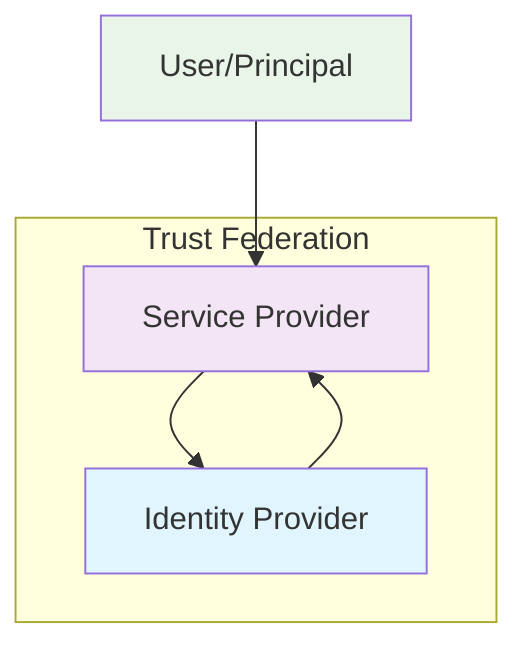

# SSO Introduction - Comprehensive Guide

## Overview

Single Sign-On (SSO) is an authentication mechanism that enables users to authenticate once and gain access to multiple applications without re-entering credentials. This comprehensive guide explores the fundamental concepts, architecture, benefits, and real-world implementations of SSO systems.

## Core Architecture

### Fundamental Components

#### 1. Principal (User)
- **Definition**: The entity requesting access to protected resources
- **Roles**: 
  - Initiates authentication requests
  - Provides credentials to Identity Provider
  - Interacts with Service Providers

#### 2. Identity Provider (IdP)
- **Primary Functions**:
  - Authenticates user credentials
  - Issues security assertions
  - Manages user sessions
  - Provides user attributes
  - Handles logout operations

#### 3. Service Provider (SP)
- **Primary Functions**:
  - Protects application resources
  - Consumes security assertions
  - Creates local sessions
  - Enforces access control
  - Redirects to IdP for authentication

### Trust Relationships



## Detailed Benefits Analysis

### User Experience Benefits

#### 1. Reduced Cognitive Load
- **Password Fatigue Elimination**: Users remember only one set of credentials
- **Streamlined Access**: Seamless navigation between applications
- **Consistent Experience**: Uniform authentication across all services

#### 2. Productivity Enhancement
- **Time Savings**: Eliminates repeated login processes
- **Reduced Friction**: Smooth transition between applications
- **Mobile Optimization**: Better experience on mobile devices

### Security Benefits

#### 1. Centralized Security Management
- **Unified Policy Enforcement**: Consistent security policies across applications
- **Centralized Monitoring**: Single point for authentication event monitoring
- **Standardized Protocols**: Common security standards implementation

#### 2. Enhanced Security Controls
- **Multi-Factor Authentication**: Centralized MFA implementation
- **Risk-Based Authentication**: Context-aware security decisions
- **Session Management**: Centralized session timeout and renewal

### Operational Benefits

#### 1. IT Cost Reduction
- **Reduced Support Costs**: Fewer password reset requests
- **Automated Provisioning**: Streamlined user lifecycle management
- **Centralized Auditing**: Simplified compliance reporting

#### 2. Administrative Efficiency
- **Unified User Management**: Single administration interface
- **Role-Based Access**: Centralized role and permission management
- **Automated Deprovisioning**: Immediate access revocation

## Core SSO Models

### Enterprise SSO (E-SSO)

#### Characteristics
- **Scope**: Internal enterprise applications
- **Protocols**: SAML, WS-Federation, Kerberos
- **Use Cases**: Corporate intranets, business applications
- **Implementation**: Typically on-premises or hybrid

#### Enterprise Benefits
- **Legacy Integration**: Support for older enterprise systems
- **Directory Integration**: Seamless Active Directory/LDAP integration
- **Compliance Support**: Meets enterprise security requirements

### Federated SSO (F-SSO)

#### Characteristics
- **Scope**: Cross-organizational applications
- **Protocols**: SAML, OpenID Connect
- **Use Cases**: B2B applications, partner portals
- **Implementation**: Cloud-based or hybrid

#### Federation Benefits
- **Trust Relationships**: Established between different organizations
- **Attribute Exchange**: Secure sharing of user attributes
- **Scalability**: Supports large-scale multi-tenant environments

### Web SSO

#### Characteristics
- **Scope**: Web applications
- **Protocols**: SAML, OpenID Connect, OAuth
- **Use Cases**: SaaS applications, customer portals
- **Implementation**: Primarily cloud-based

#### Web Benefits
- **Standards Compliance**: Based on open standards
- **Browser Compatibility**: Works across modern browsers
- **Mobile Support**: Native mobile application integration

## Implementation Patterns

### Centralized Authentication Pattern

```python
# Example: Centralized Authentication Flow
class CentralizedSSO:
    def __init__(self, idp_endpoint, sp_config):
        self.idp_endpoint = idp_endpoint
        self.sp_config = sp_config
    
    def authenticate_user(self, user_request):
        # Redirect to IdP for authentication
        auth_request = self.create_auth_request(user_request)
        return self.redirect_to_idp(auth_request)
    
    def handle_response(self, saml_response):
        # Validate SAML response from IdP
        assertion = self.validate_saml_response(saml_response)
        user_session = self.create_user_session(assertion)
        return user_session
```

### Decentralized Authentication Pattern

```python
# Example: Decentralized Authentication with Multiple IdPs
class FederatedSSO:
    def __init__(self, trusted_idps):
        self.trusted_idps = trusted_idps
    
    def discover_idp(self, user_identifier):
        # Determine which IdP to use based on user identifier
        for idp in self.trusted_idps:
            if idp.supports_user(user_identifier):
                return idp
        return None
    
    def federated_authenticate(self, user_request):
        idp = self.discover_idp(user_request.identifier)
        if idp:
            return idp.authenticate(user_request)
        else:
            raise AuthenticationError("No suitable IdP found")
```

## Real-World Use Cases

### Enterprise Use Cases

#### 1. Corporate Intranet
- **Scenario**: Employees accessing multiple internal applications
- **Benefits**: Single login to HR, CRM, ERP systems
- **Implementation**: SAML with Active Directory integration

#### 2. Partner Portal
- **Scenario**: External partners accessing shared resources
- **Benefits**: Secure external access without separate credentials
- **Implementation**: Federated SAML with partner IdPs

### Consumer Use Cases

#### 1. E-commerce Platforms
- **Scenario**: Customers accessing multiple services (shopping, support, account)
- **Benefits**: Unified customer experience
- **Implementation**: OpenID Connect with social identity providers

#### 2. Educational Platforms
- **Scenario**: Students accessing learning management systems
- **Benefits**: Seamless access to course materials
- **Implementation**: SAML with institutional identity providers

## Technical Considerations

### Protocol Selection

#### Factors to Consider
- **Application Type**: Web, mobile, desktop
- **Security Requirements**: Compliance, encryption standards
- **Integration Complexity**: Existing infrastructure compatibility
- **User Base**: Internal employees, external partners, customers

### Performance Considerations

#### Latency Optimization
- **Caching Strategies**: Metadata, certificate, session caching
- **Connection Management**: Persistent connections to IdPs
- **Load Distribution**: Multiple IdP instances for high availability

#### Scalability Planning
- **User Volume**: Expected concurrent users
- **Geographic Distribution**: Global user base considerations
- **Growth Projections**: Future expansion requirements

## Security Architecture

### Defense in Depth

#### 1. Network Security
- **TLS/SSL**: Encrypted communication channels
- **Firewall Rules**: Restricted access to authentication endpoints
- **Network Segmentation**: Isolated authentication infrastructure

#### 2. Application Security
- **Input Validation**: Sanitize all authentication inputs
- **Session Security**: Secure session management
- **Error Handling**: Secure error message disclosure

#### 3. Identity Security
- **Credential Protection**: Secure storage and transmission
- **Multi-Factor Authentication**: Additional verification layers
- **Risk Assessment**: Context-aware authentication decisions

## Implementation Checklist

### Pre-Implementation Phase
- [ ] Define authentication requirements
- [ ] Select appropriate SSO protocol
- [ ] Identify integration points
- [ ] Establish security policies
- [ ] Plan user migration strategy

### Implementation Phase
- [ ] Configure Identity Provider
- [ ] Integrate Service Providers
- [ ] Implement security controls
- [ ] Test authentication flows
- [ ] Document operational procedures

### Post-Implementation Phase
- [ ] Monitor authentication metrics
- [ ] Conduct security audits
- [ ] Update documentation
- [ ] Train support staff
- [ ] Plan for future enhancements

## Common Challenges and Solutions

### Technical Challenges

#### 1. Protocol Compatibility
- **Challenge**: Different applications supporting different protocols
- **Solution**: Protocol translation gateways or multiple protocol support

#### 2. Session Management
- **Challenge**: Coordinated session timeout across applications
- **Solution**: Centralized session management with heartbeat mechanisms

### Organizational Challenges

#### 1. Change Management
- **Challenge**: User resistance to new authentication methods
- **Solution**: Comprehensive user education and phased rollout

#### 2. Cross-Department Coordination
- **Challenge**: Multiple teams managing different applications
- **Solution**: Centralized governance and clear responsibility assignment

## Future Trends

### Emerging Technologies
- **Passwordless Authentication**: Biometric and hardware-based authentication
- **Decentralized Identity**: Blockchain-based identity management
- **AI-Powered Security**: Machine learning for threat detection

### Evolving Standards
- **Continuous Protocol Evolution**: Updates to SAML, OpenID Connect
- **New Authentication Methods**: FIDO2, WebAuthn integration
- **Privacy Enhancements**: Improved user privacy controls

## Conclusion

Single Sign-On represents a fundamental shift in how organizations manage user authentication. By understanding the core concepts, benefits, and implementation considerations outlined in this guide, organizations can successfully deploy SSO solutions that enhance security, improve user experience, and reduce operational costs.

The key to successful SSO implementation lies in careful planning, proper protocol selection, robust security implementation, and ongoing monitoring. As authentication technologies continue to evolve, SSO will remain a critical component of modern identity and access management strategies.