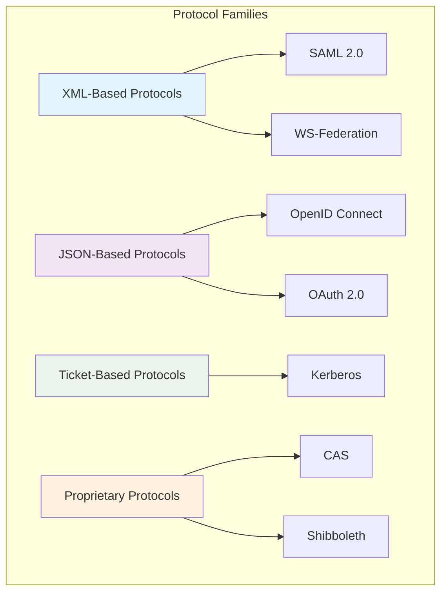

# Protocol Comparison - Comprehensive Technical Guide

## Overview

This comprehensive guide provides an in-depth comparison of major Single Sign-On (SSO) protocols, including SAML, OpenID Connect, OAuth 2.0, Kerberos, and WS-Federation. We analyze technical specifications, use cases, security considerations, and implementation patterns for each protocol.

## Protocol Architecture Comparison

### Core Protocol Characteristics



## SAML 2.0 - Security Assertion Markup Language

### Technical Deep Dive

**Architecture Pattern**: XML-based, assertion-driven

**Core Components**:
```xml
<!-- SAML Assertion Structure -->
<saml:Assertion>
    <saml:Issuer>https://idp.example.com</saml:Issuer>
    <saml:Subject>
        <saml:NameID>user@example.com</saml:NameID>
    </saml:Subject>
    <saml:Conditions>
        <saml:AudienceRestriction>
            <saml:Audience>https://sp.example.com</saml:Audience>
        </saml:AudienceRestriction>
    </saml:Conditions>
    <saml:AuthnStatement>
        <saml:AuthnContext>
            <saml:AuthnContextClassRef>
                urn:oasis:names:tc:SAML:2.0:ac:classes:Password
            </saml:AuthnContextClassRef>
        </saml:AuthnContext>
    </saml:AuthnStatement>
    <saml:AttributeStatement>
        <saml:Attribute Name="email">
            <saml:AttributeValue>user@example.com</saml:AttributeValue>
        </saml:Attribute>
    </saml:AttributeStatement>
</saml:Assertion>
```

**Implementation Example**:
```python
class SAMLServiceProvider:
    def __init__(self, config):
        self.config = config
        self.metadata_service = MetadataService()
        self.crypto_service = CryptoService()
    
    def create_authn_request(self):
        """Create SAML AuthnRequest"""
        request = {
            'ID': f"_{uuid.uuid4()}",
            'Version': '2.0',
            'IssueInstant': datetime.utcnow().isoformat() + 'Z',
            'Destination': self.config.idp_sso_url,
            'AssertionConsumerServiceURL': self.config.acs_url,
            'ProtocolBinding': 'urn:oasis:names:tc:SAML:2.0:bindings:HTTP-POST',
            'Issuer': self.config.entity_id
        }
        
        if self.config.sign_requests:
            request = self.crypto_service.sign_request(request)
        
        return request
    
    def process_response(self, saml_response):
        """Process SAML Response"""
        
        # Validate response signature
        if not self.crypto_service.verify_signature(saml_response):
            raise SecurityError("Invalid response signature")
        
        # Extract and validate assertion
        assertion = self.extract_assertion(saml_response)
        validation_result = self.validate_assertion(assertion)
        
        if not validation_result.is_valid:
            raise AuthenticationError(validation_result.errors)
        
        # Create user session
        return self.create_user_session(assertion)
```

### SAML Strengths and Limitations

**Strengths**:
- **Enterprise-Grade Security**: Strong cryptographic security with XML signatures
- **Mature Standard**: Well-established with extensive vendor support
- **Rich Attribute Exchange**: Comprehensive attribute statements
- **Federation Support**: Excellent for cross-organizational scenarios
- **Strong Authentication Context**: Detailed authentication method reporting

**Limitations**:
- **Complexity**: XML-based protocol with steep learning curve
- **Performance Overhead**: XML parsing and signature validation
- **Mobile Support**: Limited native mobile application support
- **Developer Experience**: Complex implementation compared to modern protocols

## OpenID Connect (OIDC)

### Technical Deep Dive

**Architecture Pattern**: JSON-based, token-driven

**Core Components**:
```json
{
    "iss": "https://idp.example.com",
    "sub": "1234567890",
    "aud": "client_id",
    "exp": 1311281970,
    "iat": 1311280970,
    "auth_time": 1311280969,
    "nonce": "n-0S6_WzA2Mj",
    "acr": "urn:mace:incommon:iap:silver",
    "amr": ["password", "mfa"],
    "name": "John Doe",
    "email": "john.doe@example.com",
    "email_verified": true
}
```

**Implementation Example**:
```python
class OpenIDConnectProvider:
    def __init__(self, config):
        self.config = config
        self.user_store = UserStore()
        self.token_service = TokenService()
    
    def handle_authorization_request(self, request):
        """Handle OIDC authorization request"""
        
        # Validate client
        client = self.validate_client(request.client_id, request.redirect_uri)
        
        # Authenticate user
        user = self.authenticate_user(request)
        
        # Generate authorization code
        auth_code = self.token_service.generate_authorization_code(
            user, client, request.scope
        )
        
        # Redirect with code
        redirect_url = f"{request.redirect_uri}?code={auth_code}&state={request.state}"
        return RedirectResponse(redirect_url)
    
    def handle_token_request(self, request):
        """Handle token exchange"""
        
        # Validate authorization code
        auth_data = self.token_service.validate_authorization_code(
            request.code, request.client_id, request.client_secret
        )
        
        # Generate ID token
        id_token = self.token_service.generate_id_token(
            auth_data.user, auth_data.client, auth_data.scope
        )
        
        # Generate access token
        access_token = self.token_service.generate_access_token(
            auth_data.user, auth_data.client, auth_data.scope
        )
        
        return {
            "access_token": access_token,
            "token_type": "Bearer",
            "expires_in": 3600,
            "id_token": id_token
        }
```

### OIDC Strengths and Limitations

**Strengths**:
- **Modern Protocol**: JSON-based, RESTful architecture
- **Mobile-Friendly**: Excellent support for mobile applications
- **Developer Experience**: Simple implementation with extensive libraries
- **Flexible Authentication**: Support for various authentication methods
- **Standardized Claims**: Well-defined user attribute claims

**Limitations**:
- **Limited Federation**: Less suitable for complex enterprise federation
- **Attribute Richness**: Limited compared to SAML's attribute statements
- **Security Complexity**: Multiple token types increase attack surface
- **Maturity**: Less mature than SAML for enterprise use cases

## OAuth 2.0

### Technical Deep Dive

**Architecture Pattern**: Authorization framework, token-based

**Core Flows**:
- **Authorization Code**: Web server applications
- **Implicit**: Browser-based applications (deprecated)
- **Resource Owner Password Credentials**: Trusted applications
- **Client Credentials**: Machine-to-machine communication

**Implementation Example**:
```python
class OAuth2AuthorizationServer:
    def __init__(self, config):
        self.config = config
        self.client_store = ClientStore()
        self.token_service = TokenService()
    
    def handle_authorization_code_flow(self, request):
        """Handle authorization code flow"""
        
        # Validate client
        client = self.validate_client(request.client_id, request.redirect_uri)
        
        # Authenticate resource owner
        user = self.authenticate_resource_owner(request)
        
        # Obtain consent
        if not self.obtain_consent(user, client, request.scope):
            raise ConsentRequiredError()
        
        # Generate authorization code
        auth_code = self.token_service.generate_authorization_code(
            user, client, request.scope
        )
        
        return {
            "code": auth_code,
            "state": request.state
        }
    
    def handle_token_exchange(self, request):
        """Handle token exchange"""
        
        if request.grant_type == "authorization_code":
            return self.exchange_code_for_token(request)
        elif request.grant_type == "refresh_token":
            return self.refresh_access_token(request)
        elif request.grant_type == "client_credentials":
            return self.issue_client_credentials_token(request)
        else:
            raise UnsupportedGrantTypeError()
```

### OAuth 2.0 Strengths and Limitations

**Strengths**:
- **API Authorization**: Excellent for API access delegation
- **Flexible Flows**: Multiple grant types for different scenarios
- **Wide Adoption**: Extensive ecosystem and library support
- **Mobile and Web**: Strong support for modern application types

**Limitations**:
- **Not Authentication Protocol**: Designed for authorization, not authentication
- **Security Complexity**: Multiple flows increase implementation complexity
- **Token Management**: Requires careful token storage and validation
- **Limited User Info**: No standardized user information exchange

## Kerberos

### Technical Deep Dive

**Architecture Pattern**: Ticket-based, symmetric cryptography

**Core Components**:
- **Key Distribution Center (KDC)**: Central authentication service
- **Ticket Granting Ticket (TGT)**: Initial authentication token
- **Service Ticket**: Access token for specific services

**Implementation Example**:
```python
class KerberosAuthentication:
    def __init__(self, realm, kdc_server):
        self.realm = realm
        self.kdc_server = kdc_server
    
    def authenticate_user(self, username, password):
        """Authenticate user and obtain TGT"""
        
        # Request TGT from KDC
        tgt_request = self.create_as_req(username)
        tgt_response = self.send_to_kdc(tgt_request)
        
        # Decrypt TGT response with user's password
        tgt_data = self.decrypt_tgt_response(tgt_response, password)
        
        # Store TGT for future use
        self.store_tgt(username, tgt_data)
        
        return tgt_data
    
    def request_service_ticket(self, username, service_principal):
        """Request service ticket for specific service"""
        
        # Retrieve stored TGT
        tgt_data = self.get_tgt(username)
        
        # Create TGS request
        tgs_request = self.create_tgs_req(tgt_data, service_principal)
        tgs_response = self.send_to_kdc(tgs_request)
        
        # Decrypt service ticket
        service_ticket = self.decrypt_service_ticket(tgs_response, tgt_data.session_key)
        
        return service_ticket
```

### Kerberos Strengths and Limitations

**Strengths**:
- **Single Sign-On**: Excellent for internal network environments
- **Strong Security**: Mutual authentication with symmetric cryptography
- **Performance**: Efficient ticket-based authentication
- **Windows Integration**: Native support in Windows environments

**Limitations**:
- **Network Dependency**: Requires continuous KDC availability
- **Time Synchronization**: Critical dependency on synchronized clocks
- **Cross-Domain Complexity**: Complex setup for cross-realm authentication
- **Limited Web Support**: Not designed for web applications

## WS-Federation

### Technical Deep Dive

**Architecture Pattern**: SOAP-based, claims-driven

**Core Components**:
```xml
<wst:RequestSecurityToken>
    <wst:TokenType>urn:oasis:names:tc:SAML:2.0:assertion</wst:TokenType>
    <wst:RequestType>http://docs.oasis-open.org/ws-sx/ws-trust/200512/Issue</wst:RequestType>
    <wsp:AppliesTo>
        <wsa:EndpointReference>
            <wsa:Address>https://rp.example.com/</wsa:Address>
        </wsa:EndpointReference>
    </wsp:AppliesTo>
</wst:RequestSecurityToken>
```

**Implementation Example**:
```python
class WSFederationProvider:
    def __init__(self, config):
        self.config = config
        self.sts_service = SecurityTokenService()
    
    def handle_signin_request(self, request):
        """Handle WS-Federation sign-in request"""
        
        # Parse WS-Federation parameters
        wctx = request.get('wctx')
        wreply = request.get('wreply')
        wa = request.get('wa')
        
        if wa == 'wsignin1.0':
            # Authenticate user
            user = self.authenticate_user(request)
            
            # Issue security token
            token = self.sts_service.issue_token(user, wreply)
            
            # Create sign-in response
            response = self.create_signin_response(token, wctx, wreply)
            
            return response
```

### WS-Federation Strengths and Limitations

**Strengths**:
- **Microsoft Ecosystem**: Excellent integration with Microsoft technologies
- **Active Directory**: Seamless integration with Active Directory
- **Claims-Based**: Flexible claims-based authentication
- **SOAP Support**: Strong SOAP web services support

**Limitations**:
- **Proprietary Nature**: Microsoft-centric implementation
- **Complexity**: SOAP-based protocol complexity
- **Limited Adoption**: Primarily used in Microsoft environments
- **Modern Alternatives**: Being replaced by OpenID Connect

## Detailed Protocol Comparison

### Feature Comparison Matrix

| Feature | SAML 2.0 | OpenID Connect | OAuth 2.0 | Kerberos | WS-Federation |
|---------|----------|----------------|-----------|----------|---------------|
| **Primary Use** | Enterprise SSO | Consumer SSO | API Authorization | Internal Network | Microsoft Ecosystem |
| **Protocol Type** | XML-based | JSON-based | Token-based | Ticket-based | SOAP-based |
| **Authentication** | ✅ Strong | ✅ Strong | ❌ Limited | ✅ Strong | ✅ Strong |
| **Authorization** | ✅ Basic | ✅ Basic | ✅ Primary | ✅ Basic | ✅ Basic |
| **Federation** | ✅ Excellent | ✅ Good | ❌ Limited | ✅ Complex | ✅ Good |
| **Mobile Support** | ❌ Limited | ✅ Excellent | ✅ Excellent | ❌ Limited | ❌ Limited |
| **Web Support** | ✅ Excellent | ✅ Excellent | ✅ Excellent | ❌ Limited | ✅ Good |
| **API Support** | ❌ Limited | ✅ Good | ✅ Excellent | ❌ Limited | ✅ Good |
| **Security** | ✅ Strong | ✅ Good | ✅ Good | ✅ Strong | ✅ Good |
| **Complexity** | High | Medium | Medium | High | High |
| **Maturity** | High | Medium | High | High | Medium |

### Performance Characteristics

```python
class ProtocolPerformanceAnalyzer:
    def __init__(self):
        self.metrics_collector = MetricsCollector()
    
    def analyze_protocol_performance(self, protocol, scenario):
        """Analyze protocol performance characteristics"""
        
        performance_data = {
            'message_size': self.measure_message_size(protocol, scenario),
            'processing_time': self.measure_processing_time(protocol, scenario),
            'network_roundtrips': self.count_roundtrips(protocol, scenario),
            'cryptographic_overhead': self.measure_crypto_overhead(protocol),
            'memory_usage': self.measure_memory_usage(protocol)
        }
        
        return PerformanceAnalysis(performance_data)
    
    def measure_message_size(self, protocol, scenario):
        """Measure typical message sizes"""
        
        if protocol == 'SAML':
            return 2000  # 2KB typical SAML assertion
        elif protocol == 'OIDC':
            return 500   # 500B typical JWT
        elif protocol == 'OAuth':
            return 300   # 300B typical token response
        elif protocol == 'Kerberos':
            return 1000  # 1KB typical ticket
        elif protocol == 'WS-Fed':
            return 3000  # 3KB typical SOAP message
```

### Security Comparison

```python
class SecurityComparison:
    def __init__(self, security_analyzer):
        self.security_analyzer = security_analyzer
    
    def compare_security_features(self):
        """Compare security features across protocols"""
        
        security_matrix = {
            'SAML': {
                'message_integrity': 'XML Signature',
                'confidentiality': 'XML Encryption',
                'replay_protection': 'Message IDs + Timestamps',
                'authentication_strength': 'Strong',
                'vulnerabilities': ['XML Injection', 'XXE']
            },
            'OIDC': {
                'message_integrity': 'JWT Signature',
                'confidentiality': 'TLS + Optional JWE',
                'replay_protection': 'Nonce + Timestamps',
                'authentication_strength': 'Good',
                'vulnerabilities': ['Token Leakage', 'CSRF']
            },
            'OAuth': {
                'message_integrity': 'TLS',
                'confidentiality': 'TLS',
                'replay_protection': 'Limited',
                'authentication_strength': 'Variable',
                'vulnerabilities': ['Token Hijacking', 'Redirect URI']
            },
            'Kerberos': {
                'message_integrity': 'Symmetric Crypto',
                'confidentiality': 'Symmetric Crypto',
                'replay_protection': 'Timestamps',
                'authentication_strength': 'Strong',
                'vulnerabilities': ['Pass-the-Ticket', 'Golden Ticket']
            },
            'WS-Fed': {
                'message_integrity': 'XML Signature',
                'confidentiality': 'XML Encryption',
                'replay_protection': 'Message IDs',
                'authentication_strength': 'Good',
                'vulnerabilities': ['XML Injection', 'WS-Addressing']
            }
        }
        
        return security_matrix
```

## Implementation Scenarios

### Enterprise SSO Scenario

```python
class EnterpriseSSOSelector:
    def select_protocol(self, requirements):
        """Select appropriate protocol for enterprise SSO"""
        
        score_card = {}
        
        # Evaluate SAML
        score_card['SAML'] = self.evaluate_saml(requirements)
        
        # Evaluate OIDC
        score_card['OIDC'] = self.evaluate_oidc(requirements)
        
        # Evaluate Kerberos
        score_card['Kerberos'] = self.evaluate_kerberos(requirements)
        
        # Select best protocol
        best_protocol = max(score_card.items(), key=lambda x: x[1]['score'])
        
        return ProtocolRecommendation(
            protocol=best_protocol[0],
            score=best_protocol[1]['score'],
            rationale=best_protocol[1]['rationale']
        )
    
    def evaluate_saml(self, requirements):
        """Evaluate SAML for given requirements"""
        
        score = 0
        rationale = []
        
        if requirements.enterprise_federation:
            score += 30
            rationale.append("Excellent for enterprise federation")
        
        if requirements.strong_security:
            score += 25
            rationale.append("Strong cryptographic security")
        
        if requirements.legacy_integration:
            score += 20
            rationale.append("Good legacy system integration")
        
        if requirements.mobile_first:
            score -= 15
            rationale.append("Limited mobile support")
        
        return {'score': score, 'rationale': rationale}
```

### Cloud-Native Scenario

```python
class CloudNativeSSOSelector:
    def select_protocol(self, requirements):
        """Select protocol for cloud-native applications"""
        
        if requirements.api_first:
            return ProtocolRecommendation(
                protocol='OAuth',
                score=95,
                rationale="Best for API authorization scenarios"
            )
        
        elif requirements.mobile_first:
            return ProtocolRecommendation(
                protocol='OIDC',
                score=90,
                rationale="Excellent mobile and modern web support"
            )
        
        elif requirements.enterprise_integration:
            return ProtocolRecommendation(
                protocol='SAML',
                score=85,
                rationale="Strong enterprise integration capabilities"
            )
```

## Migration Strategies

### SAML to OpenID Connect Migration

```python
class SAMLToOIDCMigration:
    def __init__(self, saml_config, oidc_config):
        self.saml_config = saml_config
        self.oidc_config = oidc_config
        self.migration_service = MigrationService()
    
    def create_migration_plan(self):
        """Create migration plan from SAML to OIDC"""
        
        plan = {
            'phase_1': {
                'description': 'Dual protocol support',
                'tasks': [
                    'Implement OIDC provider alongside SAML',
                    'Configure application for dual protocol support',
                    'Test OIDC flows without production traffic'
                ]
            },
            'phase_2': {
                'description': 'Gradual traffic migration',
                'tasks': [
                    'Route small percentage of traffic to OIDC',
                    'Monitor performance and error rates',
                    'Gradually increase OIDC traffic percentage'
                ]
            },
            'phase_3': {
                'description': 'Full migration and cleanup',
                'tasks': [
                    'Migrate all traffic to OIDC',
                    'Remove SAML dependencies',
                    'Update documentation and training'
                ]
            }
        }
        
        return MigrationPlan(plan)
    
    def migrate_attributes(self, saml_attributes):
        """Migrate SAML attributes to OIDC claims"""
        
        claim_mapping = {
            'email': 'email',
            'firstName': 'given_name',
            'lastName': 'family_name',
            'uid': 'sub',
            'groups': 'groups'
        }
        
        oidc_claims = {}
        
        for saml_attr, oidc_claim in claim_mapping.items():
            if saml_attr in saml_attributes:
                oidc_claims[oidc_claim] = saml_attributes[saml_attr]
        
        return oidc_claims
```

## Hybrid Implementation Patterns

### Multi-Protocol Gateway

```python
class MultiProtocolGateway:
    def __init__(self, protocol_handlers):
        self.protocol_handlers = protocol_handlers
    
    def handle_authentication_request(self, request):
        """Handle authentication request using appropriate protocol"""
        
        # Detect protocol
        protocol = self.detect_protocol(request)
        
        if protocol not in self.protocol_handlers:
            raise UnsupportedProtocolError(f"Unsupported protocol: {protocol}")
        
        # Delegate to appropriate handler
        handler = self.protocol_handlers[protocol]
        return handler.handle_request(request)
    
    def detect_protocol(self, request):
        """Detect authentication protocol from request"""
        
        if 'SAMLRequest' in request.params:
            return 'SAML'
        elif 'client_id' in request.params and 'response_type' in request.params:
            return 'OIDC'
        elif 'client_id' in request.params and 'grant_type' in request.params:
            return 'OAuth'
        elif 'wa' in request.params:
            return 'WS-Fed'
        else:
            return 'Unknown'
```

## Conclusion

Choosing the right SSO protocol depends on specific requirements, including security needs, integration complexity, user experience, and existing infrastructure. This comprehensive comparison provides the technical foundation for making informed protocol selection decisions.

**Key Selection Criteria**:
- **Enterprise Federation**: SAML remains the gold standard
- **Modern Web/Mobile**: OpenID Connect provides excellent developer experience
- **API Authorization**: OAuth 2.0 is the clear choice
- **Internal Networks**: Kerberos offers seamless integration
- **Microsoft Ecosystems**: WS-Federation provides native integration

**Future Trends**:
- Convergence towards OpenID Connect for most new implementations
- Continued SAML usage in enterprise federation scenarios
- Increased focus on passwordless and biometric authentication
- Growing importance of decentralized identity standards

By understanding the strengths, limitations, and appropriate use cases for each protocol, organizations can implement SSO solutions that meet their specific requirements while providing secure, seamless authentication experiences.