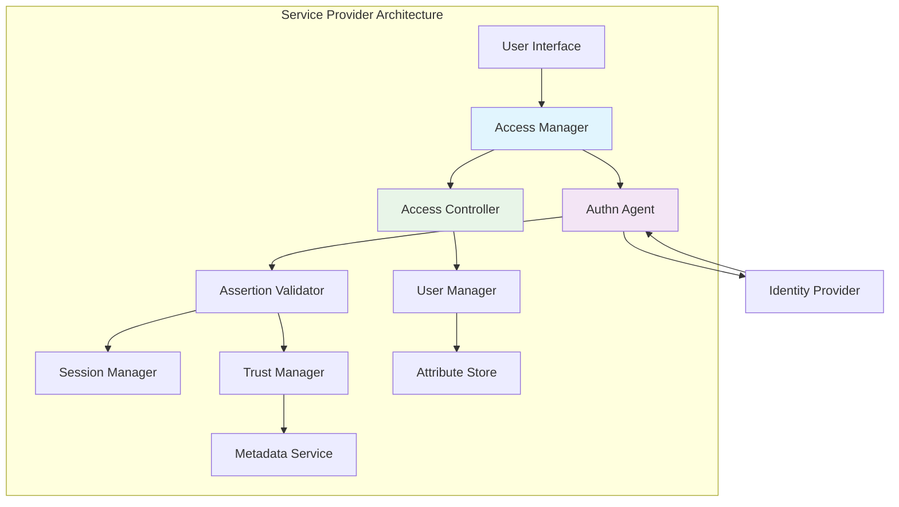

# Service Provider (SP) - Comprehensive Technical Guide

## Overview

A Service Provider (SP) is a system entity that relies on Identity Provider assertions to grant access to protected resources. This comprehensive guide explores SP architecture, implementation patterns, security considerations, and integration best practices for building robust SSO-enabled applications.

## SP Architecture Deep Dive

### Core Components Architecture



### Authentication Agent Implementation

#### Comprehensive SP Handler

```python
class ServiceProvider:
    def __init__(self, sp_config, idp_metadata_service, session_manager):
        self.sp_config = sp_config
        self.idp_metadata_service = idp_metadata_service
        self.session_manager = session_manager
        self.trust_manager = TrustManager()
        self.assertion_validator = AssertionValidator()
    
    def protect_resource(self, request):
        """Main entry point for resource protection"""
        
        # Check for existing session
        session = self.session_manager.get_session(request)
        if session and session.is_valid():
            return self.grant_access(session.user)
        
        # No valid session - initiate SSO
        return self.initiate_sso(request)
    
    def initiate_sso(self, request, relay_state=None):
        """Initiate SP-initiated SSO flow"""
        
        # Create AuthnRequest
        authn_request = self.create_authn_request(request)
        
        # Get IdP SSO endpoint
        idp_metadata = self.idp_metadata_service.get_metadata()
        sso_endpoint = idp_metadata.get_sso_endpoint(
            binding='urn:oasis:names:tc:SAML:2.0:bindings:HTTP-Redirect'
        )
        
        # Create redirect URL
        redirect_url = self.create_redirect_url(authn_request, sso_endpoint, relay_state)
        
        # Store request state
        self.session_manager.store_request_state(authn_request.id, {
            'relay_state': relay_state,
            'created_at': datetime.utcnow(),
            'request_url': request.url
        })
        
        return redirect_url
    
    def process_saml_response(self, saml_response, relay_state=None):
        """Process SAML response from IdP"""
        
        # Validate response
        validation_result = self.validate_saml_response(saml_response)
        if not validation_result.is_valid:
            raise AuthenticationError(f"SAML response validation failed: {validation_result.errors}")
        
        # Extract assertion
        assertion = validation_result.assertion
        
        # Validate assertion
        assertion_validation = self.validate_assertion(assertion)
        if not assertion_validation.is_valid:
            raise AuthenticationError(f"Assertion validation failed: {assertion_validation.errors}")
        
        # Create user session
        user_session = self.create_user_session(assertion, relay_state)
        
        # Retrieve original request state
        request_state = self.session_manager.get_request_state(assertion.in_response_to)
        
        return AuthenticationResult(
            success=True,
            user_session=user_session,
            redirect_url=request_state.get('request_url') if request_state else None
        )
```

## Detailed SP Implementation

### Authentication Request Generation

#### Comprehensive AuthnRequest Builder

```python
from datetime import datetime
import uuid

class AuthnRequestBuilder:
    def __init__(self, sp_config):
        self.sp_config = sp_config
    
    def create_authn_request(self, request_context=None):
        """Create a SAML AuthnRequest"""
        
        request_id = f"_{uuid.uuid4()}"
        issue_instant = datetime.utcnow()
        
        authn_request = {
            'id': request_id,
            'version': '2.0',
            'issue_instant': issue_instant.isoformat() + 'Z',
            'destination': self.get_idp_sso_url(),
            'assertion_consumer_service_url': self.sp_config['acs_url'],
            'protocol_binding': 'urn:oasis:names:tc:SAML:2.0:bindings:HTTP-POST',
            'issuer': {
                'value': self.sp_config['entity_id'],
                'format': 'urn:oasis:names:tc:SAML:2.0:nameid-format:entity'
            },
            'name_id_policy': {
                'format': self.sp_config.get('name_id_format', 
                                           'urn:oasis:names:tc:SAML:1.1:nameid-format:unspecified'),
                'allow_create': True
            },
            'requested_authn_context': self.build_requested_authn_context(),
            'force_authn': request_context.get('force_authn', False) if request_context else False,
            'is_passive': request_context.get('is_passive', False) if request_context else False,
            'attribute_consuming_service_index': self.get_attribute_consuming_service_index()
        }
        
        # Sign the request if configured
        if self.sp_config.get('sign_authn_requests', False):
            authn_request = self.sign_authn_request(authn_request)
        
        return authn_request
    
    def build_requested_authn_context(self):
        """Build requested authentication context"""
        
        authn_contexts = self.sp_config.get('requested_authn_contexts', [
            'urn:oasis:names:tc:SAML:2.0:ac:classes:PasswordProtectedTransport'
        ])
        
        return {
            'comparison': 'minimum',
            'authn_context_class_refs': authn_contexts
        }
    
    def get_attribute_consuming_service_index(self):
        """Get attribute consuming service index"""
        
        requested_attributes = self.sp_config.get('requested_attributes', [])
        if requested_attributes:
            return 1  # Reference to attribute consuming service in metadata
        
        return None
```

### Assertion Validation Service

#### Comprehensive Validation Framework

```python
class AssertionValidator:
    def __init__(self, idp_metadata_service, certificate_validator):
        self.idp_metadata_service = idp_metadata_service
        self.certificate_validator = certificate_validator
        self.used_assertion_ids = set()
    
    def validate_assertion(self, assertion):
        """Validate SAML assertion"""
        
        validation_errors = []
        
        # 1. Schema validation
        if not self.validate_schema(assertion):
            validation_errors.append("Schema validation failed")
        
        # 2. Signature validation
        if not self.validate_signature(assertion):
            validation_errors.append("Signature validation failed")
        
        # 3. Timestamp validation
        timestamp_validation = self.validate_timestamps(assertion)
        if not timestamp_validation.is_valid:
            validation_errors.extend(timestamp_validation.errors)
        
        # 4. Conditions validation
        conditions_validation = self.validate_conditions(assertion)
        if not conditions_validation.is_valid:
            validation_errors.extend(conditions_validation.errors)
        
        # 5. Subject validation
        subject_validation = self.validate_subject(assertion)
        if not subject_validation.is_valid:
            validation_errors.extend(subject_validation.errors)
        
        # 6. Replay attack prevention
        if not self.prevent_replay_attack(assertion):
            validation_errors.append("Possible replay attack detected")
        
        # 7. Audience restriction
        if not self.validate_audience(assertion):
            validation_errors.append("Audience restriction validation failed")
        
        return ValidationResult(
            is_valid=len(validation_errors) == 0,
            errors=validation_errors,
            assertion=assertion
        )
    
    def validate_signature(self, assertion):
        """Validate assertion signature"""
        
        if not assertion.signature:
            return False
        
        # Get IdP signing certificate
        idp_metadata = self.idp_metadata_service.get_metadata()
        idp_certificates = idp_metadata.get_signing_certificates()
        
        # Try each certificate until one works
        for certificate in idp_certificates:
            try:
                if self.certificate_validator.verify_signature(
                    assertion.raw_xml,
                    assertion.signature,
                    certificate
                ):
                    return True
            except SignatureVerificationError:
                continue
        
        return False
    
    def validate_timestamps(self, assertion):
        """Validate assertion timestamps"""
        
        errors = []
        current_time = datetime.utcnow()
        
        # Check issue instant
        if assertion.issue_instant > current_time:
            errors.append("Assertion issue instant is in the future")
        
        # Check conditions
        if assertion.conditions:
            if assertion.conditions.not_before:
                if current_time < assertion.conditions.not_before:
                    errors.append("Assertion not yet valid")
            
            if assertion.conditions.not_on_or_after:
                if current_time >= assertion.conditions.not_on_or_after:
                    errors.append("Assertion has expired")
        
        # Check subject confirmation data
        if assertion.subject and assertion.subject.confirmation_data:
            if assertion.subject.confirmation_data.not_on_or_after:
                if current_time >= assertion.subject.confirmation_data.not_on_or_after:
                    errors.append("Subject confirmation has expired")
        
        return ValidationResult(
            is_valid=len(errors) == 0,
            errors=errors
        )
    
    def prevent_replay_attack(self, assertion):
        """Prevent replay attacks by tracking used assertion IDs"""
        
        assertion_id = assertion.id
        
        # Check if we've seen this assertion ID before
        if assertion_id in self.used_assertion_ids:
            return False
        
        # Add to used IDs and clean up old entries
        self.used_assertion_ids.add(assertion_id)
        self.cleanup_used_ids()
        
        return True
    
    def cleanup_used_ids(self):
        """Clean up old assertion IDs to prevent memory exhaustion"""
        
        # Implement LRU or time-based cleanup
        if len(self.used_assertion_ids) > 10000:
            # Remove oldest entries
            self.used_assertion_ids = set(list(self.used_assertion_ids)[-5000:])
```

## Session Management

### Distributed Session Storage

```python
import redis
import json
from datetime import datetime, timedelta

class DistributedSessionManager:
    def __init__(self, redis_config, session_ttl=3600):
        self.redis_pool = redis.ConnectionPool(**redis_config)
        self.session_ttl = session_ttl
    
    def create_session(self, user_info, assertion, relay_state=None):
        """Create a new user session"""
        
        session_id = f"sess_{uuid.uuid4()}"
        
        session_data = {
            'session_id': session_id,
            'user_id': user_info['user_id'],
            'username': user_info['username'],
            'email': user_info.get('email'),
            'attributes': user_info.get('attributes', {}),
            'created_at': datetime.utcnow().isoformat(),
            'last_accessed': datetime.utcnow().isoformat(),
            'expires_at': (datetime.utcnow() + timedelta(seconds=self.session_ttl)).isoformat(),
            'assertion_id': assertion.id,
            'idp_session_index': assertion.authn_statement.session_index,
            'relay_state': relay_state
        }
        
        redis_client = redis.Redis(connection_pool=self.redis_pool)
        
        # Store session data
        redis_client.setex(
            f"session:{session_id}",
            self.session_ttl,
            json.dumps(session_data)
        )
        
        # Store user->session mapping
        redis_client.sadd(f"user_sessions:{user_info['user_id']}", session_id)
        
        return session_id
    
    def get_session(self, session_id):
        """Retrieve session data"""
        
        redis_client = redis.Redis(connection_pool=self.redis_pool)
        
        session_data = redis_client.get(f"session:{session_id}")
        if session_data:
            session_dict = json.loads(session_data)
            
            # Update last accessed time
            session_dict['last_accessed'] = datetime.utcnow().isoformat()
            redis_client.setex(
                f"session:{session_id}",
                self.session_ttl,
                json.dumps(session_dict)
            )
            
            return session_dict
        
        return None
    
    def invalidate_session(self, session_id):
        """Invalidate a session"""
        
        redis_client = redis.Redis(connection_pool=self.redis_pool)
        
        # Get session data to remove user mapping
        session_data = self.get_session(session_id)
        if session_data:
            redis_client.srem(f"user_sessions:{session_data['user_id']}", session_id)
        
        # Remove session
        redis_client.delete(f"session:{session_id}")
    
    def invalidate_user_sessions(self, user_id):
        """Invalidate all sessions for a user"""
        
        redis_client = redis.Redis(connection_pool=self.redis_pool)
        
        # Get all session IDs for user
        session_ids = redis_client.smembers(f"user_sessions:{user_id}")
        
        # Delete all sessions
        for session_id in session_ids:
            redis_client.delete(f"session:{session_id.decode()}")
        
        # Remove user mapping
        redis_client.delete(f"user_sessions:{user_id}")
```

## User Management and Attribute Mapping

### Attribute Processing Service

```python
class AttributeProcessor:
    def __init__(self, attribute_mappings, user_store):
        self.attribute_mappings = attribute_mappings
        self.user_store = user_store
    
    def process_assertion_attributes(self, assertion, create_user_if_missing=True):
        """Process attributes from SAML assertion"""
        
        # Extract attributes from assertion
        raw_attributes = self.extract_attributes(assertion)
        
        # Map attributes according to configuration
        mapped_attributes = self.map_attributes(raw_attributes)
        
        # Get or create user
        user_identifier = self.get_user_identifier(assertion, mapped_attributes)
        user = self.user_store.get_user(user_identifier)
        
        if not user and create_user_if_missing:
            user = self.create_user(user_identifier, mapped_attributes)
        
        if user:
            # Update user attributes
            self.update_user_attributes(user, mapped_attributes)
            
            return user
        
        return None
    
    def extract_attributes(self, assertion):
        """Extract attributes from SAML assertion"""
        
        attributes = {}
        
        if assertion.attribute_statement:
            for attr in assertion.attribute_statement.attributes:
                attr_name = attr.name
                attr_values = [av.value for av in attr.attribute_values]
                
                if len(attr_values) == 1:
                    attributes[attr_name] = attr_values[0]
                else:
                    attributes[attr_name] = attr_values
        
        # Also extract from NameID if present
        if assertion.subject and assertion.subject.name_id:
            attributes['name_id'] = assertion.subject.name_id.value
            attributes['name_id_format'] = assertion.subject.name_id.format
        
        return attributes
    
    def map_attributes(self, raw_attributes):
        """Map attributes according to configuration"""
        
        mapped_attributes = {}
        
        for target_attr, mapping in self.attribute_mappings.items():
            source_attr = mapping.get('source')
            transform = mapping.get('transform')
            default_value = mapping.get('default')
            
            if source_attr in raw_attributes:
                value = raw_attributes[source_attr]
                
                # Apply transformation if specified
                if transform:
                    value = self.apply_transform(value, transform)
                
                mapped_attributes[target_attr] = value
            elif default_value is not None:
                mapped_attributes[target_attr] = default_value
        
        return mapped_attributes
    
    def apply_transform(self, value, transform):
        """Apply attribute transformation"""
        
        if transform == 'lowercase':
            return value.lower() if isinstance(value, str) else value
        elif transform == 'uppercase':
            return value.upper() if isinstance(value, str) else value
        elif transform == 'trim':
            return value.strip() if isinstance(value, str) else value
        elif transform.startswith('regex:'):
            # Extract regex pattern
            pattern = transform[6:]
            import re
            match = re.search(pattern, value)
            return match.group(1) if match else value
        else:
            return value
```

## SP Metadata Management

### Dynamic Metadata Generation

```python
class SPMetadataService:
    def __init__(self, sp_config, certificate_manager):
        self.sp_config = sp_config
        self.certificate_manager = certificate_manager
    
    def generate_metadata(self):
        """Generate SP metadata"""
        
        metadata = {
            'entity_id': self.sp_config['entity_id'],
            'valid_until': (datetime.utcnow() + timedelta(days=365)).isoformat() + 'Z',
            'organization': self.sp_config.get('organization', {}),
            'contact_persons': self.sp_config.get('contact_persons', []),
            'sp_sso_descriptor': self.build_sp_sso_descriptor()
        }
        
        return self.serialize_metadata(metadata)
    
    def build_sp_sso_descriptor(self):
        """Build SP SSO descriptor"""
        
        return {
            'authn_requests_signed': self.sp_config.get('sign_authn_requests', False),
            'want_assertions_signed': True,
            'protocol_support_enumeration': 'urn:oasis:names:tc:SAML:2.0:protocol',
            'key_descriptors': self.build_key_descriptors(),
            'assertion_consumer_services': self.build_acs_services(),
            'single_logout_services': self.build_slo_services(),
            'name_id_formats': self.build_name_id_formats(),
            'attribute_consuming_services': self.build_attribute_services()
        }
    
    def build_acs_services(self):
        """Build Assertion Consumer Services"""
        
        acs_services = []
        
        # HTTP-POST ACS
        acs_services.append({
            'index': 0,
            'is_default': True,
            'binding': 'urn:oasis:names:tc:SAML:2.0:bindings:HTTP-POST',
            'location': self.sp_config['acs_url']
        })
        
        # HTTP-Redirect ACS (if configured)
        if self.sp_config.get('acs_redirect_url'):
            acs_services.append({
                'index': 1,
                'is_default': False,
                'binding': 'urn:oasis:names:tc:SAML:2.0:bindings:HTTP-Redirect',
                'location': self.sp_config['acs_redirect_url']
            })
        
        return acs_services
    
    def build_attribute_services(self):
        """Build Attribute Consuming Services"""
        
        requested_attributes = self.sp_config.get('requested_attributes', [])
        if not requested_attributes:
            return []
        
        return [{
            'index': 0,
            'is_default': True,
            'service_names': [
                {'value': self.sp_config.get('service_name', 'Service'), 
                 'lang': 'en'}
            ],
            'requested_attributes': self.build_requested_attributes()
        }]
    
    def build_requested_attributes(self):
        """Build requested attributes configuration"""
        
        requested_attributes = []
        attribute_configs = self.sp_config.get('requested_attributes', [])
        
        for attr_config in attribute_configs:
            requested_attributes.append({
                'name': attr_config['name'],
                'name_format': attr_config.get('name_format', 
                                             'urn:oasis:names:tc:SAML:2.0:attrname-format:basic'),
                'friendly_name': attr_config.get('friendly_name'),
                'is_required': attr_config.get('is_required', False)
            })
        
        return requested_attributes
```

## Security Implementation

### Comprehensive Security Manager

```python
class SPSecurityManager:
    def __init__(self, sp_config, idp_metadata_service):
        self.sp_config = sp_config
        self.idp_metadata_service = idp_metadata_service
        self.certificate_store = CertificateStore()
        self.attack_detector = AttackDetector()
    
    def validate_incoming_request(self, request):
        """Validate incoming SAML request/response"""
        
        security_checks = []
        
        # 1. Message format validation
        if not self.validate_message_format(request):
            security_checks.append("Invalid message format")
        
        # 2. Timestamp validation
        if not self.validate_timestamps(request):
            security_checks.append("Timestamp validation failed")
        
        # 3. Signature validation
        if not self.validate_message_signature(request):
            security_checks.append("Signature validation failed")
        
        # 4. Replay attack detection
        if self.attack_detector.detect_replay_attack(request):
            security_checks.append("Replay attack detected")
        
        # 5. XML injection detection
        if self.attack_detector.detect_xml_injection(request):
            security_checks.append("XML injection detected")
        
        return SecurityValidationResult(
            is_secure=len(security_checks) == 0,
            security_checks=security_checks
        )
    
    def apply_security_headers(self, response):
        """Apply security headers to HTTP responses"""
        
        security_headers = {
            'Content-Security-Policy': "default-src 'self'; script-src 'self' 'unsafe-inline';",
            'X-Content-Type-Options': 'nosniff',
            'X-Frame-Options': 'DENY',
            'X-XSS-Protection': '1; mode=block',
            'Strict-Transport-Security': 'max-age=31536000; includeSubDomains',
            'Referrer-Policy': 'strict-origin-when-cross-origin'
        }
        
        for header, value in security_headers.items():
            response.headers[header] = value
    
    def encrypt_sensitive_data(self, data):
        """Encrypt sensitive data at rest"""
        
        encryption_key = self.get_encryption_key()
        
        # Use authenticated encryption
        from cryptography.fernet import Fernet
        fernet = Fernet(encryption_key)
        
        encrypted_data = fernet.encrypt(data.encode())
        
        return encrypted_data
    
    def audit_security_event(self, event_type, details):
        """Log security events for auditing"""
        
        audit_log = {
            'timestamp': datetime.utcnow().isoformat(),
            'event_type': event_type,
            'details': details,
            'ip_address': self.get_client_ip(),
            'user_agent': self.get_user_agent()
        }
        
        # Log to security audit system
        self.security_logger.log(audit_log)
        
        # Alert on critical events
        if event_type in ['authentication_failure', 'security_breach']:
            self.alert_security_team(audit_log)
```

## Integration Patterns

### Framework Integration

#### Django Integration

```python
# django_sso/middleware.py
from django.utils.deprecation import MiddlewareMixin

class SSOMiddleware(MiddlewareMixin):
    def __init__(self, get_response):
        self.get_response = get_response
        self.sp_handler = ServiceProvider(
            sp_config=settings.SAML_SP_CONFIG,
            idp_metadata_service=IdpMetadataService(settings.SAML_IDP_METADATA_URL),
            session_manager=DistributedSessionManager(settings.REDIS_CONFIG)
        )
    
    def process_request(self, request):
        # Skip SSO for static files and admin
        if self.should_skip_sso(request):
            return None
        
        # Check for SAML response
        if 'SAMLResponse' in request.POST:
            return self.process_saml_response(request)
        
        # Check for existing session
        session = self.get_user_session(request)
        if session:
            request.user = session.user
            return None
        
        # No session - redirect to IdP
        return self.initiate_sso(request)
    
    def process_saml_response(self, request):
        saml_response = request.POST.get('SAMLResponse')
        relay_state = request.POST.get('RelayState')
        
        try:
            auth_result = self.sp_handler.process_saml_response(saml_response, relay_state)
            
            # Set session cookie
            response = self.create_session_response(auth_result.user_session)
            
            # Redirect to original URL
            if auth_result.redirect_url:
                response['Location'] = auth_result.redirect_url
            
            return response
            
        except AuthenticationError as e:
            logger.error(f"SAML authentication failed: {e}")
            return self.render_error_page("Authentication failed")
```

#### Flask Integration

```python
# flask_sso/extension.py
from flask import current_app, redirect, request, session

class SSOExtension:
    def __init__(self, app=None):
        self.app = app
        if app is not None:
            self.init_app(app)
    
    def init_app(self, app):
        self.sp_handler = ServiceProvider(
            sp_config=app.config['SAML_SP_CONFIG'],
            idp_metadata_service=IdpMetadataService(app.config['SAML_IDP_METADATA_URL']),
            session_manager=DistributedSessionManager(app.config['REDIS_CONFIG'])
        )
        
        # Register blueprint
        from .views import sso_bp
        app.register_blueprint(sso_bp)
        
        # Add before request handler
        app.before_request(self.check_authentication)
    
    def check_authentication(self):
        # Skip for static files and login endpoints
        if request.endpoint in ['static', 'sso.login', 'sso.acs']:
            return
        
        # Check session
        if 'user_id' in session:
            return
        
        # Redirect to login
        return redirect('/sso/login')
```

## Monitoring and Analytics

### Comprehensive Monitoring

```python
from prometheus_client import Counter, Histogram, Gauge

class SPMetrics:
    def __init__(self):
        self.auth_requests = Counter('sp_auth_requests_total', 
                                   'Total authentication requests',
                                   ['method', 'status'])
        
        self.auth_duration = Histogram('sp_auth_duration_seconds',
                                     'Authentication request duration')
        
        self.active_sessions = Gauge('sp_active_sessions',
                                   'Number of active sessions')
        
        self.assertions_processed = Counter('sp_assertions_processed_total',
                                          'Total assertions processed',
                                          ['status'])
        
        self.security_events = Counter('sp_security_events_total',
                                     'Total security events',
                                     ['type', 'severity'])
    
    def record_authentication(self, method, status, duration):
        self.auth_requests.labels(method=method, status=status).inc()
        self.auth_duration.observe(duration)
    
    def record_assertion_processing(self, status):
        self.assertions_processed.labels(status=status).inc()
    
    def record_security_event(self, event_type, severity):
        self.security_events.labels(type=event_type, severity=severity).inc()
```

## Conclusion

Service Providers are critical components in SSO architectures that require careful implementation to ensure security, performance, and user experience. This comprehensive guide has covered the essential components, implementation patterns, and best practices for building robust SP solutions.

Key success factors include:
- Robust assertion validation with comprehensive security checks
- Secure session management with proper expiration and cleanup
- Flexible attribute mapping and user provisioning
- Comprehensive metadata management
- Strong security implementation with proper encryption and auditing
- Seamless framework integration
- Extensive monitoring and analytics

By following the patterns and practices outlined in this guide, organizations can build SP solutions that provide secure, seamless authentication experiences while maintaining the highest standards of security and reliability.